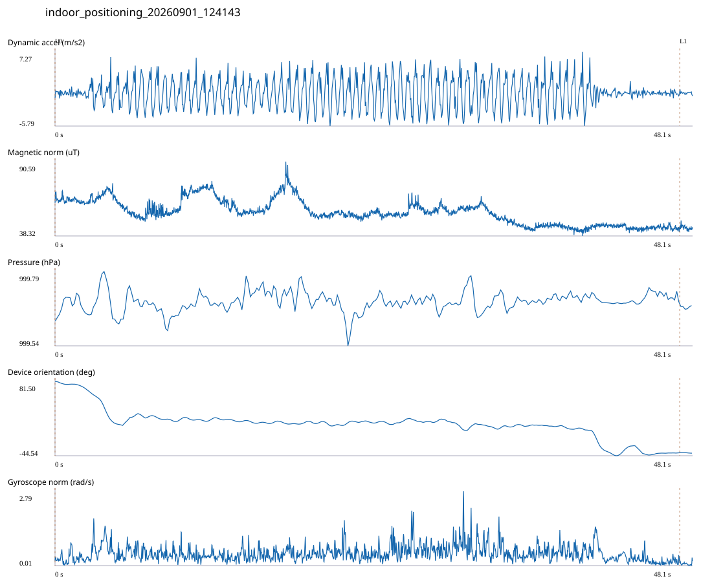

# 4F_LEGACY_TO_4204 / indoor_positioning_20260901_124143.jsonl

원본: `C:\Users\20222967\Documents\ChatGPT\자율설계 2\indoor\data\raw\2026-09-01\indoor_positioning_20260901_124143.jsonl`

SHA-256: `1db97e9c0bcf0ea6ecfb9ea445fde9b3b77f5e8eb90f4975a2fd9c6d8433621d`

기존 분석: baseline summary/segments; excluded logs quality only / 기존 상태: legacy_excluded

시간 48.108초 · 카운터 — · 가속도 피크 후보(.7/1/1.3): {'0.7': 75, '1.0': 69, '1.3': 68}

방향 출처: `quaternion_device_yaw_not_walking_heading`. 휴대폰 회전 후보를 보행 회전으로 확정하지 않는다.

L0,L1…은 원본 라벨 시점이다. 표시 위치 정답이나 지도 경로가 아니다.

## 품질·한계

- Excluded by existing manifest; quality audit only, not training or truth.
- Device orientation is not calibrated walking direction; no absolute map-path accuracy claim.

## 센서 기록

|센서|샘플|동일 wall time|중앙 간격 ms|최대 공백 s|
|---|---:|---:|---:|---:|
|accelerometer_mps2|21993|3460|2.000|0.029|
|gyroscope_rads|2199|1|22.000|0.046|
|magnetic_field_ut|2406|0|20.000|0.033|
|pressure_hpa|301|0|160.000|0.172|
|rotation_vector|2199|11|21.000|0.055|

## 랩 구간 분석

|구간|초|카운터|피크 후보|동적 RMS|B 평균±SD µT|기압차 hPa|기기방향 변화°|
|---|---:|---:|---:|---:|---|---:|---:|
|코어복도·메인복도 교차점 → 코어복도·메인복도 교차점|47.132|—|69|2.566|55.023 ± 8.652|0.024|-121.125|
|코어복도·메인복도 교차점 → session_end (not position truth)|0.976|—|0|0.235|44.099 ± 1.401|0.003|-0.715|

## 2초 창의 휴대폰 방향 변화 후보

|시점 s|방향 변화°|자이로 RMS|동시 피크 후보|
|---:|---:|---:|---:|
|2.552|-31.326|0.529|2|
|40.202|-31.360|0.703|4|

각도 변화30°/2초는 진단용 기준이다. 자세 변화·자기장 교란·축 정의 영향을 포함한다. 가속도 피크도 실제 걸음 정답이 아니다. 샘플 수는 물리 센서의 독립 관측 수와 같지 않다.
