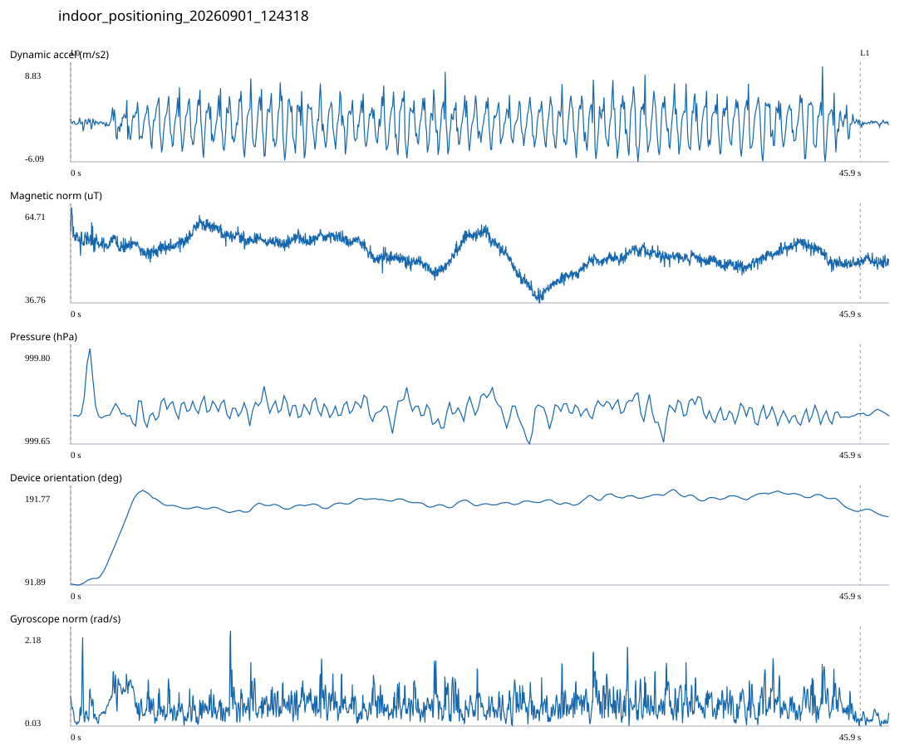

# 4F_LEGACY_TO_4128 / indoor_positioning_20260901_124318.jsonl

원본: `C:\Users\20222967\Documents\ChatGPT\자율설계 2\indoor\data\raw\2026-09-01\indoor_positioning_20260901_124318.jsonl`

SHA-256: `608747b3c7a07a3495efda5e9e26e41745333c01d90f579a943f74c8a77d7bed`

기존 분석: baseline summary/segments; excluded logs quality only / 기존 상태: legacy_excluded

시간 45.897초 · 카운터 — · 가속도 피크 후보(.7/1/1.3): {'0.7': 74, '1.0': 73, '1.3': 73}

방향 출처: `quaternion_device_yaw_not_walking_heading`. 휴대폰 회전 후보를 보행 회전으로 확정하지 않는다.

L0,L1…은 원본 라벨 시점이다. 표시 위치 정답이나 지도 경로가 아니다.

## 품질·한계

- Excluded by existing manifest; quality audit only, not training or truth.
- Device orientation is not calibrated walking direction; no absolute map-path accuracy claim.

## 센서 기록

|센서|샘플|동일 wall time|중앙 간격 ms|최대 공백 s|
|---|---:|---:|---:|---:|
|accelerometer_mps2|20982|3004|2.000|0.018|
|gyroscope_rads|2098|0|22.000|0.035|
|magnetic_field_ut|2295|0|20.000|0.031|
|pressure_hpa|287|0|160.000|0.172|
|rotation_vector|2098|3|21.000|0.056|

## 랩 구간 분석

|구간|초|카운터|피크 후보|동적 RMS|B 평균±SD µT|기압차 hPa|기기방향 변화°|
|---|---:|---:|---:|---:|---|---:|---:|
|코어복도·메인복도 교차점 → 코어복도·메인복도 교차점|44.266|—|73|2.667|51.576 ± 4.320|-0.007|76.182|
|코어복도·메인복도 교차점 → session_end (not position truth)|1.631|—|0|0.239|48.968 ± 1.033|-0.002|-6.324|

## 2초 창의 휴대폰 방향 변화 후보

|시점 s|방향 변화°|자이로 RMS|동시 피크 후보|
|---:|---:|---:|---:|
|1.251|30.685|0.482|0|
|3.251|65.761|0.782|3|

각도 변화30°/2초는 진단용 기준이다. 자세 변화·자기장 교란·축 정의 영향을 포함한다. 가속도 피크도 실제 걸음 정답이 아니다. 샘플 수는 물리 센서의 독립 관측 수와 같지 않다.
