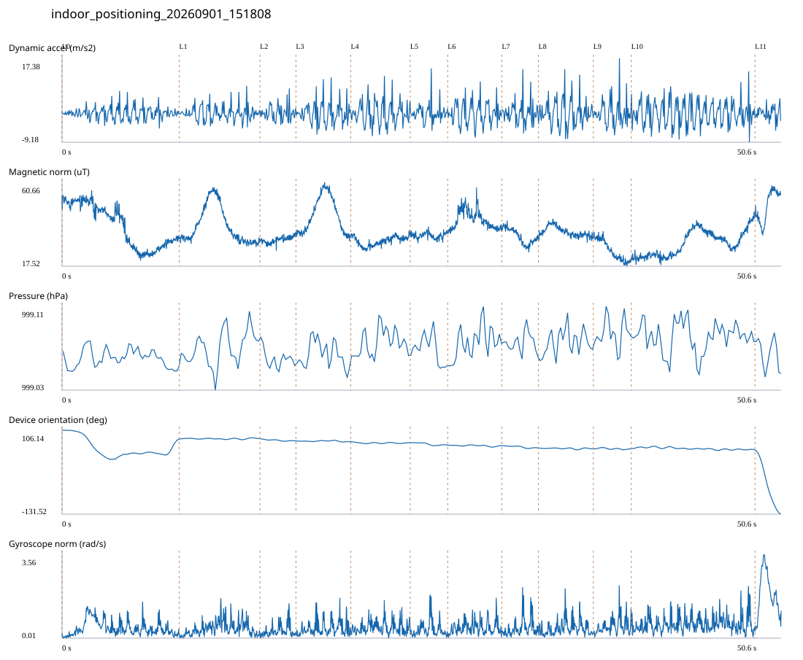

# 4F_CORE_TO_RIGHT_STAIRS / indoor_positioning_20260901_151808.jsonl

원본: `C:\Users\20222967\Documents\ChatGPT\자율설계 2\indoor\data\raw\2026-09-01\indoor_positioning_20260901_151808.jsonl`

SHA-256: `748bf6c7e2a75969a47a328a80ac3a83833758a1042103a1272b4ce9ccbef697`

기존 분석: baseline summary/segments; special routes no path accuracy / 기존 상태: accepted

시간 50.645초 · 카운터 67.000 · 가속도 피크 후보(.7/1/1.3): {'0.7': 91, '1.0': 89, '1.3': 88}

방향 출처: `quaternion_device_yaw_not_walking_heading`. 휴대폰 회전 후보를 보행 회전으로 확정하지 않는다.

L0,L1…은 원본 라벨 시점이다. 표시 위치 정답이나 지도 경로가 아니다.

## 품질·한계

- Device orientation is not calibrated walking direction; no absolute map-path accuracy claim.
- Zero counter increments coexist with acceleration peaks; counter-only segment distance is unreliable.

## 센서 기록

|센서|샘플|동일 wall time|중앙 간격 ms|최대 공백 s|
|---|---:|---:|---:|---:|
|accelerometer_mps2|23176|2972|2.000|0.023|
|gyroscope_rads|2318|1|22.000|0.043|
|magnetic_field_ut|2535|1|20.000|0.037|
|pressure_hpa|317|0|160.000|0.173|
|rotation_vector|2317|4|21.000|0.049|
|step_counter|52|0|547.000|5.929|

## 랩 구간 분석

|구간|초|카운터|피크 후보|동적 RMS|B 평균±SD µT|기압차 hPa|기기방향 변화°|
|---|---:|---:|---:|---:|---|---:|---:|
|코어복도 출구 중앙점 → 4213 앞|8.247|10.000|13|1.976|38.321 ± 10.908|-0.003|-25.877|
|4213 앞 → 4212 앞|5.695|7.000|11|2.369|38.354 ± 9.220|0.020|1.531|
|4212 앞 → 4211 앞|2.529|0.000|4|2.414|31.107 ± 1.626|-0.016|-6.225|
|4211 앞 → 4210 앞|3.862|7.000|7|3.546|43.877 ± 9.024|-0.006|-2.001|
|4210 앞 → 4209 앞|4.184|6.000|7|3.797|30.439 ± 2.401|0.010|-2.658|
|4209 앞 → 4208 앞|2.640|3.000|4|2.942|33.272 ± 1.533|-0.017|-6.957|
|4208 앞 → 4207 앞|3.813|5.000|6|3.691|41.343 ± 4.696|0.019|-1.115|
|4207 앞 → 4206 앞|2.579|2.000|3|3.576|32.823 ± 3.788|-0.007|-6.491|
|4206 앞 → 4205 앞|3.863|6.000|8|4.252|35.248 ± 2.561|0.009|-2.730|
|4205 앞 → 4204 앞|2.672|4.000|4|4.203|25.534 ± 5.158|0.006|0.515|
|4204 앞 → 오른쪽 계단 입구|8.712|16.000|18|4.000|29.325 ± 6.484|0.001|-3.184|
|오른쪽 계단 입구 → session_end (not position truth)|1.849|1.000|4|2.174|48.528 ± 7.930|-0.030|-181.484|

## 2초 창의 휴대폰 방향 변화 후보

|시점 s|방향 변화°|자이로 RMS|동시 피크 후보|
|---:|---:|---:|---:|
|1.002|-36.013|0.557|2|
|3.002|-38.618|0.678|3|
|7.052|31.597|0.419|4|
|48.252|-33.548|1.011|4|

각도 변화30°/2초는 진단용 기준이다. 자세 변화·자기장 교란·축 정의 영향을 포함한다. 가속도 피크도 실제 걸음 정답이 아니다. 샘플 수는 물리 센서의 독립 관측 수와 같지 않다.
