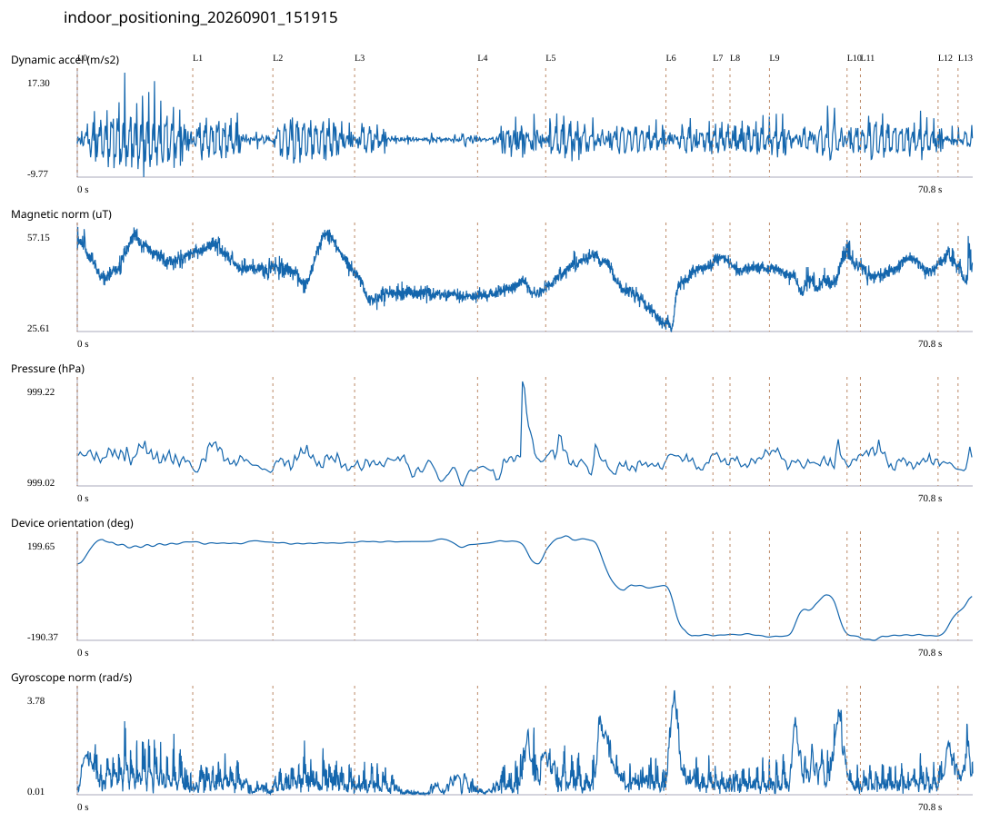

# 4F_LEFT_OLD_MIXED_ROWS / indoor_positioning_20260901_151915.jsonl

원본: `C:\Users\20222967\Documents\ChatGPT\자율설계 2\indoor\data\raw\2026-09-01\indoor_positioning_20260901_151915.jsonl`

SHA-256: `6128de63d38cc8df931d0d8367c32deb82dedba9d51de7c37727b646b089ff76`

기존 분석: baseline summary/segments; excluded logs quality only / 기존 상태: legacy_excluded

시간 70.783초 · 카운터 87.000 · 가속도 피크 후보(.7/1/1.3): {'0.7': 129, '1.0': 125, '1.3': 116}

방향 출처: `quaternion_device_yaw_not_walking_heading`. 휴대폰 회전 후보를 보행 회전으로 확정하지 않는다.

L0,L1…은 원본 라벨 시점이다. 표시 위치 정답이나 지도 경로가 아니다.

## 품질·한계

- Excluded by existing manifest; quality audit only, not training or truth.
- Device orientation is not calibrated walking direction; no absolute map-path accuracy claim.
- Zero counter increments coexist with acceleration peaks; counter-only segment distance is unreliable.

## 센서 기록

|센서|샘플|동일 wall time|중앙 간격 ms|최대 공백 s|
|---|---:|---:|---:|---:|
|accelerometer_mps2|32351|4099|2.000|0.025|
|gyroscope_rads|3236|0|22.000|0.042|
|magnetic_field_ut|3539|0|20.000|0.035|
|pressure_hpa|454|0|160.000|0.240|
|rotation_vector|3235|8|21.000|0.054|
|step_counter|67|0|525.500|14.133|

## 랩 구간 분석

|구간|초|카운터|피크 후보|동적 RMS|B 평균±SD µT|기압차 hPa|기기방향 변화°|
|---|---:|---:|---:|---:|---|---:|---:|
|코어복도 출구 중앙점 → 4218 앞|9.127|15.000|19|4.399|48.197 ± 3.600|-0.010|82.247|
|4218 앞 → 4120 앞|6.333|8.000|11|2.301|47.487 ± 3.129|-0.010|-1.511|
|4120 앞 → 4222 앞|6.462|11.000|13|2.927|46.699 ± 4.640|-0.010|-0.823|
|4222 앞 → 4122 앞|9.720|3.000|11|1.100|37.101 ± 1.793|-0.014|-5.992|
|4122 앞 → 4123 앞|5.384|0.000|7|1.823|38.094 ± 1.540|0.021|-26.210|
|4123 앞 → 4225 앞|9.505|18.000|18|2.298|40.635 ± 6.191|-0.027|-134.730|
|4225 앞 → 4124 앞|3.712|1.000|7|1.866|40.020 ± 6.276|-0.009|-183.945|
|4124 앞 → 4125 앞|1.348|0.000|3|2.219|47.405 ± 0.993|-0.020|4.898|
|4125 앞 → 4126 앞|3.121|10.000|6|2.446|44.672 ± 0.995|0.009|-9.944|
|4126 앞 → 4228 앞|6.133|8.000|11|2.441|42.163 ± 3.005|-0.013|13.185|
|4228 앞 → 4127 앞|1.057|1.000|2|2.053|47.121 ± 2.264|0.023|-13.191|
|4127 앞 → 4128 앞|6.136|11.000|12|2.736|44.633 ± 1.975|-0.014|7.711|
|4128 앞 → 왼쪽 계단 입구|1.579|1.000|2|1.412|47.390 ± 1.715|-0.009|85.915|
|왼쪽 계단 입구 → session_end (not position truth)|1.166|0.000|3|1.482|44.364 ± 3.259|0.024|59.169|

## 2초 창의 휴대폰 방향 변화 후보

|시점 s|방향 변화°|자이로 RMS|동시 피크 후보|
|---:|---:|---:|---:|
|1.022|90.435|1.054|4|
|34.472|-33.742|0.812|4|
|36.522|31.495|1.342|3|
|40.222|-34.206|0.866|4|
|42.222|-152.842|1.674|4|
|45.972|-34.969|1.025|4|
|47.972|-144.489|1.825|4|
|55.622|34.418|0.806|4|
|57.622|100.314|1.422|4|
|59.622|-108.590|1.749|4|
|61.622|-35.161|0.636|4|
|67.822|32.609|0.785|3|

각도 변화30°/2초는 진단용 기준이다. 자세 변화·자기장 교란·축 정의 영향을 포함한다. 가속도 피크도 실제 걸음 정답이 아니다. 샘플 수는 물리 센서의 독립 관측 수와 같지 않다.
