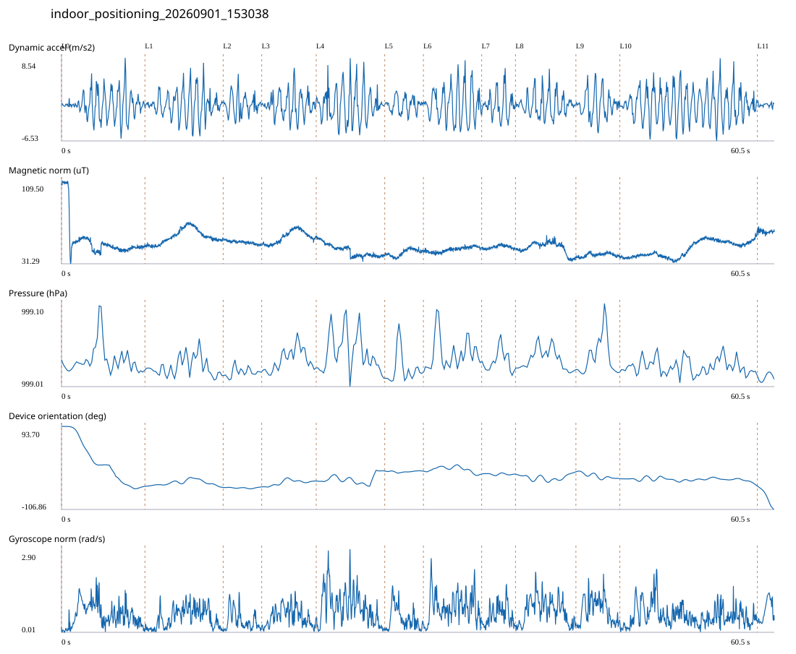

# 4F_CORE_TO_RIGHT_STAIRS / indoor_positioning_20260901_153038.jsonl

원본: `C:\Users\20222967\Documents\ChatGPT\자율설계 2\indoor\data\raw\2026-09-01\indoor_positioning_20260901_153038.jsonl`

SHA-256: `4146c8c88de6741f4508dbf955b1c106da5604cc30b2ed7410206c0c1639e052`

기존 분석: baseline summary/segments; special routes no path accuracy / 기존 상태: accepted_with_review

시간 60.501초 · 카운터 54.000 · 가속도 피크 후보(.7/1/1.3): {'0.7': 91, '1.0': 84, '1.3': 80}

방향 출처: `quaternion_device_yaw_not_walking_heading`. 휴대폰 회전 후보를 보행 회전으로 확정하지 않는다.

L0,L1…은 원본 라벨 시점이다. 표시 위치 정답이나 지도 경로가 아니다.

## 품질·한계

- Device orientation is not calibrated walking direction; no absolute map-path accuracy claim.
- Zero counter increments coexist with acceleration peaks; counter-only segment distance is unreliable.

## 센서 기록

|센서|샘플|동일 wall time|중앙 간격 ms|최대 공백 s|
|---|---:|---:|---:|---:|
|accelerometer_mps2|27677|4153|2.000|0.029|
|gyroscope_rads|2768|2|22.000|0.048|
|magnetic_field_ut|3028|1|20.000|0.041|
|pressure_hpa|379|0|160.000|0.185|
|rotation_vector|2768|15|21.000|0.062|
|step_counter|29|0|590.000|14.284|

## 랩 구간 분석

|구간|초|카운터|피크 후보|동적 RMS|B 평균±SD µT|기압차 hPa|기기방향 변화°|
|---|---:|---:|---:|---:|---|---:|---:|
|코어복도 출구 중앙점 → 4213 앞|7.079|8.000|10|2.307|53.644 ± 18.098|-0.003|-144.859|
|4213 앞 → 4212 앞|6.641|8.000|9|2.400|56.816 ± 6.637|-0.004|-2.596|
|4212 앞 → 4211 앞|3.271|3.000|4|1.766|51.518 ± 1.566|0.005|1.221|
|4211 앞 → 4210 앞|4.627|0.000|6|2.119|56.485 ± 5.795|0.007|13.974|
|4210 앞 → 4209 앞|5.813|7.000|9|2.964|43.667 ± 5.733|0.003|24.446|
|4209 앞 → 4208 앞|3.285|0.000|3|1.301|41.720 ± 3.213|0.010|-0.219|
|4208 앞 → 4207 앞|4.943|9.000|7|3.040|44.586 ± 2.347|0.013|-6.550|
|4207 앞 → 4206 앞|2.871|2.000|4|2.253|46.963 ± 1.589|-0.006|-0.520|
|4206 앞 → 4205 앞|5.127|0.000|8|1.998|46.376 ± 5.439|-0.004|5.604|
|4205 앞 → 4204 앞|3.728|0.000|5|2.368|39.547 ± 1.669|-0.001|-16.769|
|4204 앞 → 오른쪽 계단 입구|11.668|17.000|19|2.843|45.105 ± 7.364|-0.004|-16.729|
|오른쪽 계단 입구 → session_end (not position truth)|1.448|0.000|0|0.328|61.623 ± 1.668|0.001|-56.607|

## 2초 창의 휴대폰 방향 변화 후보

|시점 s|방향 변화°|자이로 RMS|동시 피크 후보|
|---:|---:|---:|---:|
|1.003|-52.741|0.709|2|
|3.003|-40.693|0.911|3|
|5.003|-54.318|0.677|4|
|25.953|30.029|0.851|4|
|58.603|-30.118|0.513|3|

각도 변화30°/2초는 진단용 기준이다. 자세 변화·자기장 교란·축 정의 영향을 포함한다. 가속도 피크도 실제 걸음 정답이 아니다. 샘플 수는 물리 센서의 독립 관측 수와 같지 않다.
