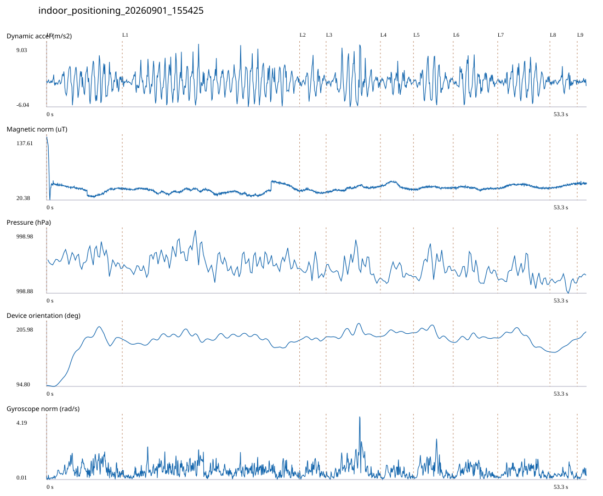

# 4F_CORE_TO_LEFT_STAIRS / indoor_positioning_20260901_155425.jsonl

원본: `C:\Users\20222967\Documents\ChatGPT\자율설계 2\indoor\data\raw\2026-09-01\indoor_positioning_20260901_155425.jsonl`

SHA-256: `e0715500a50e0ddb748c1c8149ad268616e5a366b45dd1d517bdff08d5ff0d27`

기존 분석: baseline summary/segments; special routes no path accuracy / 기존 상태: accepted

시간 53.292초 · 카운터 53.000 · 가속도 피크 후보(.7/1/1.3): {'0.7': 82, '1.0': 79, '1.3': 73}

방향 출처: `quaternion_device_yaw_not_walking_heading`. 휴대폰 회전 후보를 보행 회전으로 확정하지 않는다.

L0,L1…은 원본 라벨 시점이다. 표시 위치 정답이나 지도 경로가 아니다.

## 품질·한계

- Device orientation is not calibrated walking direction; no absolute map-path accuracy claim.
- Zero counter increments coexist with acceleration peaks; counter-only segment distance is unreliable.

## 센서 기록

|센서|샘플|동일 wall time|중앙 간격 ms|최대 공백 s|
|---|---:|---:|---:|---:|
|accelerometer_mps2|24370|4142|2.000|0.026|
|gyroscope_rads|2437|0|22.000|0.043|
|magnetic_field_ut|2666|1|20.000|0.046|
|pressure_hpa|333|0|160.000|0.181|
|rotation_vector|2437|8|21.000|0.055|
|step_counter|32|0|601.000|6.322|

## 랩 구간 분석

|구간|초|카운터|피크 후보|동적 RMS|B 평균±SD µT|기압차 hPa|기기방향 변화°|
|---|---:|---:|---:|---:|---|---:|---:|
|코어복도 출구 중앙점 → 4120 앞|7.469|0.000|11|2.318|42.764 ± 16.796|-0.003|82.020|
|4120 앞 → 4122 앞|17.502|27.000|30|2.702|38.090 ± 6.251|0.008|-1.631|
|4122 앞 → 4123 앞|2.614|2.000|4|2.036|36.787 ± 2.704|-0.005|5.199|
|4123 앞 → 4124 앞|5.359|7.000|8|3.082|41.896 ± 3.632|-0.014|0.599|
|4124 앞 → 4125 앞|3.262|3.000|5|1.409|47.205 ± 5.186|0.009|6.614|
|4125 앞 → 4126 앞|3.922|0.000|5|2.558|43.208 ± 1.846|0.011|-16.856|
|4126 앞 → 4127 앞|4.393|8.000|6|2.248|42.508 ± 1.989|0.000|7.721|
|4127 앞 → 4128 앞|5.152|6.000|8|2.244|45.916 ± 2.996|-0.005|-24.327|
|4128 앞 → 왼쪽 계단 입구|2.695|0.000|2|1.041|46.862 ± 2.907|-0.003|22.769|
|왼쪽 계단 입구 → session_end (not position truth)|0.924|0.000|0|0.390|51.226 ± 1.477|0.006|12.488|

## 2초 창의 휴대폰 방향 변화 후보

|시점 s|방향 변화°|자이로 RMS|동시 피크 후보|
|---:|---:|---:|---:|
|1.201|30.871|0.468|2|
|3.201|54.572|0.858|4|
|39.051|-30.300|0.885|3|
|47.151|-30.521|0.736|3|

각도 변화30°/2초는 진단용 기준이다. 자세 변화·자기장 교란·축 정의 영향을 포함한다. 가속도 피크도 실제 걸음 정답이 아니다. 샘플 수는 물리 센서의 독립 관측 수와 같지 않다.
