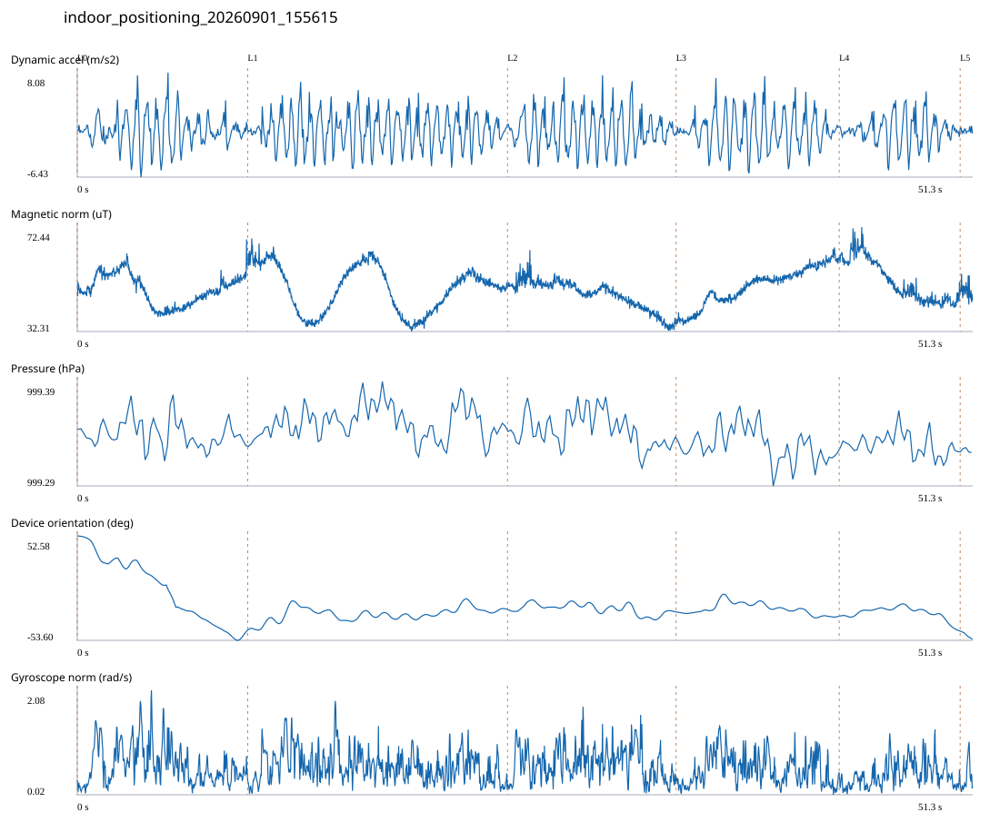

# 3F_CORE_TO_RIGHT_STAIRS / indoor_positioning_20260901_155615.jsonl

원본: `C:\Users\20222967\Documents\ChatGPT\자율설계 2\indoor\data\raw\2026-09-01\indoor_positioning_20260901_155615.jsonl`

SHA-256: `4ee505dc759c50184dee7620250f7d14437c6cb560559b806a772270b4ce42b9`

기존 분석: baseline summary/segments; special routes no path accuracy / 기존 상태: accepted

시간 51.324초 · 카운터 70.000 · 가속도 피크 후보(.7/1/1.3): {'0.7': 83, '1.0': 78, '1.3': 75}

방향 출처: `quaternion_device_yaw_not_walking_heading`. 휴대폰 회전 후보를 보행 회전으로 확정하지 않는다.

L0,L1…은 원본 라벨 시점이다. 표시 위치 정답이나 지도 경로가 아니다.

## 품질·한계

- Device orientation is not calibrated walking direction; no absolute map-path accuracy claim.

## 센서 기록

|센서|샘플|동일 wall time|중앙 간격 ms|최대 공백 s|
|---|---:|---:|---:|---:|
|accelerometer_mps2|23462|2971|2.000|0.026|
|gyroscope_rads|2349|0|22.000|0.038|
|magnetic_field_ut|2567|0|20.000|0.037|
|pressure_hpa|321|0|160.000|0.172|
|rotation_vector|2349|8|21.000|0.057|
|step_counter|50|0|572.000|6.301|

## 랩 구간 분석

|구간|초|카운터|피크 후보|동적 RMS|B 평균±SD µT|기압차 hPa|기기방향 변화°|
|---|---:|---:|---:|---:|---|---:|---:|
|코어복도 출구 중앙점 → 3210 앞|9.767|11.000|14|2.295|48.419 ± 5.801|-0.002|-96.092|
|3210 앞 → 3210-1 앞|14.892|23.000|25|2.512|48.663 ± 8.834|0.009|20.568|
|3210-1 앞 → 3208 앞|9.663|17.000|16|2.692|46.431 ± 5.597|-0.014|-2.202|
|3208 앞 → 3203 앞|9.348|12.000|14|2.620|49.701 ± 7.194|-0.008|-4.215|
|3203 앞 → 오른쪽 계단 입구|6.930|7.000|9|2.050|51.671 ± 7.908|-0.008|-14.965|
|오른쪽 계단 입구 → session_end (not position truth)|0.724|0.000|0|0.353|47.766 ± 2.798|-0.001|-8.438|

## 2초 창의 휴대폰 방향 변화 후보

|시점 s|방향 변화°|자이로 RMS|동시 피크 후보|
|---:|---:|---:|---:|
|4.252|-31.278|0.987|4|

각도 변화30°/2초는 진단용 기준이다. 자세 변화·자기장 교란·축 정의 영향을 포함한다. 가속도 피크도 실제 걸음 정답이 아니다. 샘플 수는 물리 센서의 독립 관측 수와 같지 않다.
