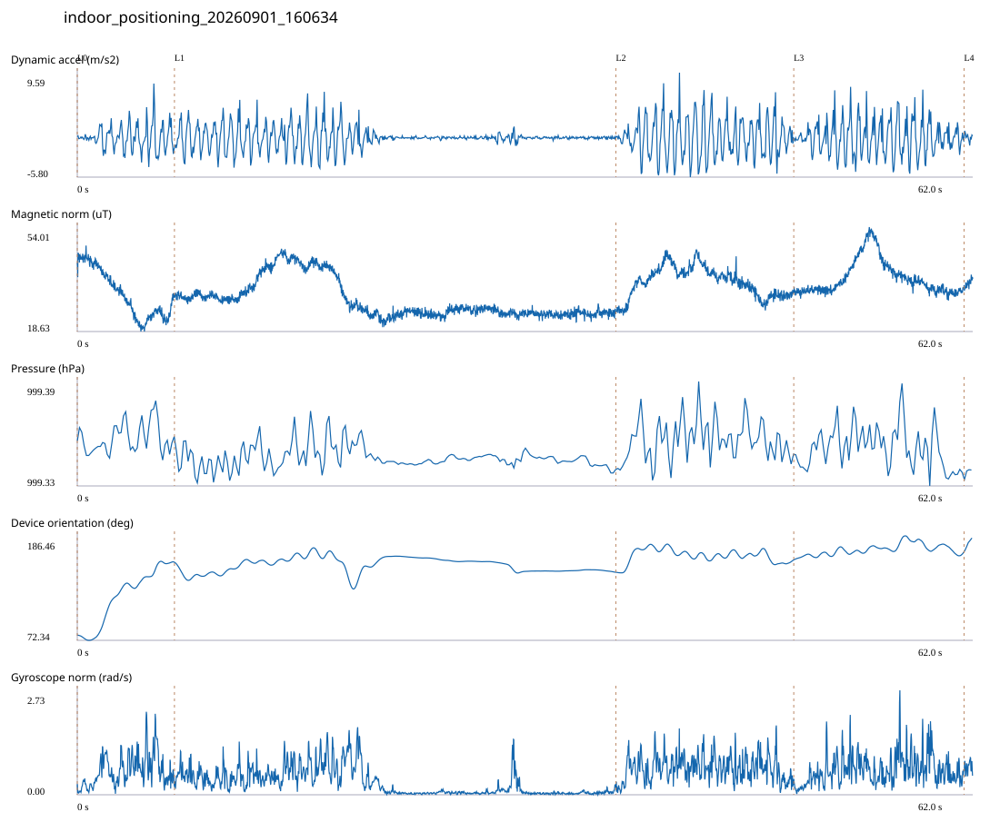

# 3F_CORE_TO_LEFT_STAIRS / indoor_positioning_20260901_160634.jsonl

원본: `C:\Users\20222967\Documents\ChatGPT\자율설계 2\indoor\data\raw\2026-09-01\indoor_positioning_20260901_160634.jsonl`

SHA-256: `7b42a9900da70208b7fe45a38e781a6f6f8698fd50617fea4f834744c3ea666f`

기존 분석: baseline summary/segments; special routes no path accuracy / 기존 상태: accepted

시간 62.016초 · 카운터 67.000 · 가속도 피크 후보(.7/1/1.3): {'0.7': 77, '1.0': 75, '1.3': 73}

방향 출처: `quaternion_device_yaw_not_walking_heading`. 휴대폰 회전 후보를 보행 회전으로 확정하지 않는다.

L0,L1…은 원본 라벨 시점이다. 표시 위치 정답이나 지도 경로가 아니다.

## 품질·한계

- Device orientation is not calibrated walking direction; no absolute map-path accuracy claim.

## 센서 기록

|센서|샘플|동일 wall time|중앙 간격 ms|최대 공백 s|
|---|---:|---:|---:|---:|
|accelerometer_mps2|28362|3458|2.000|0.027|
|gyroscope_rads|2836|0|22.000|0.037|
|magnetic_field_ut|3103|0|20.000|0.032|
|pressure_hpa|388|0|160.000|0.172|
|rotation_vector|2836|10|21.000|0.056|
|step_counter|51|0|590.000|20.984|

## 랩 구간 분석

|구간|초|카운터|피크 후보|동적 RMS|B 평균±SD µT|기압차 hPa|기기방향 변화°|
|---|---:|---:|---:|---:|---|---:|---:|
|코어복도 출구 중앙점 → 3120 앞|6.729|7.000|9|1.833|31.445 ± 8.071|0.003|79.825|
|3120 앞 → 3128-B 앞|30.568|24.000|25|1.516|29.240 ± 6.441|-0.001|-10.566|
|3128-B 앞 → 3128-A 앞|12.320|19.000|21|2.927|35.474 ± 5.056|-0.000|13.443|
|3128-A 앞 → 왼쪽 계단 입구|11.791|16.000|19|2.517|36.805 ± 5.810|-0.008|8.328|
|왼쪽 계단 입구 → session_end (not position truth)|0.608|1.000|1|0.556|34.997 ± 1.356|0.006|13.906|

## 2초 창의 휴대폰 방향 변화 후보

|시점 s|방향 변화°|자이로 RMS|동시 피크 후보|
|---:|---:|---:|---:|
|1.154|30.740|0.589|1|
|18.004|-31.585|0.951|4|
|20.004|31.254|0.696|3|
|38.604|30.536|0.722|3|

각도 변화30°/2초는 진단용 기준이다. 자세 변화·자기장 교란·축 정의 영향을 포함한다. 가속도 피크도 실제 걸음 정답이 아니다. 샘플 수는 물리 센서의 독립 관측 수와 같지 않다.
