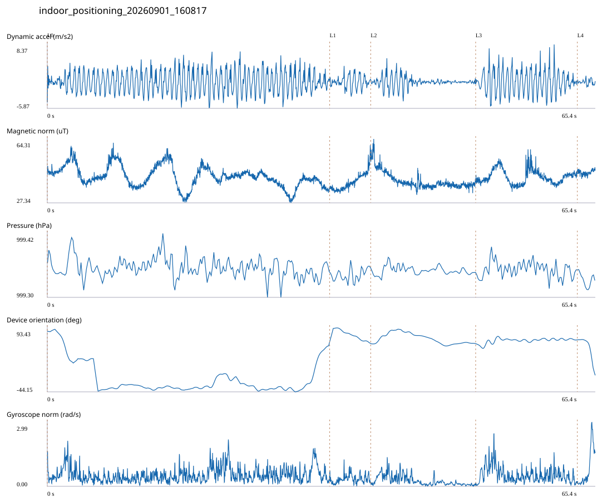

# 3F_EXTENSION / indoor_positioning_20260901_160817.jsonl

원본: `C:\Users\20222967\Documents\ChatGPT\자율설계 2\indoor\data\raw\2026-09-01\indoor_positioning_20260901_160817.jsonl`

SHA-256: `0b79d9f3d457ee562f6cff28005873746c25adcccc5accec55f71aef02856dea`

기존 분석: baseline summary/segments; special routes no path accuracy / 기존 상태: accepted

시간 65.363초 · 카운터 81.000 · 가속도 피크 후보(.7/1/1.3): {'0.7': 98, '1.0': 95, '1.3': 93}

방향 출처: `quaternion_device_yaw_not_walking_heading`. 휴대폰 회전 후보를 보행 회전으로 확정하지 않는다.

L0,L1…은 원본 라벨 시점이다. 표시 위치 정답이나 지도 경로가 아니다.

## 품질·한계

- Device orientation is not calibrated walking direction; no absolute map-path accuracy claim.
- Zero counter increments coexist with acceleration peaks; counter-only segment distance is unreliable.

## 센서 기록

|센서|샘플|동일 wall time|중앙 간격 ms|최대 공백 s|
|---|---:|---:|---:|---:|
|accelerometer_mps2|29876|4297|2.000|0.028|
|gyroscope_rads|2990|1|22.000|0.045|
|magnetic_field_ut|3269|0|20.000|0.041|
|pressure_hpa|409|0|160.000|0.171|
|rotation_vector|2990|14|21.000|0.056|
|step_counter|66|0|568.000|12.055|

## 랩 구간 분석

|구간|초|카운터|피크 후보|동적 RMS|B 평균±SD µT|기압차 hPa|기기방향 변화°|
|---|---:|---:|---:|---:|---|---:|---:|
|메인복도·증축부 교차점 → 증축부 입구|33.679|55.000|59|2.431|42.576 ± 6.093|-0.004|-24.276|
|증축부 입구 → 자유공간|4.892|1.000|7|1.366|39.369 ± 4.956|0.016|-5.044|
|자유공간 → 3104-2 앞|12.519|6.000|7|1.131|40.055 ± 4.766|-0.002|0.171|
|3104-2 앞 → 3104-1 앞|12.129|19.000|20|2.627|42.365 ± 4.103|-0.004|8.187|
|3104-1 앞 → session_end (not position truth)|2.144|0.000|2|0.567|44.862 ± 1.385|-0.015|-76.365|

## 2초 창의 휴대폰 방향 변화 후보

|시점 s|방향 변화°|자이로 RMS|동시 피크 후보|
|---:|---:|---:|---:|
|1.102|-32.135|0.628|3|
|4.752|-32.128|0.470|4|
|6.752|-30.195|0.379|3|
|30.652|30.648|0.573|3|
|32.652|74.973|0.898|3|
|63.852|-30.423|0.561|2|

각도 변화30°/2초는 진단용 기준이다. 자세 변화·자기장 교란·축 정의 영향을 포함한다. 가속도 피크도 실제 걸음 정답이 아니다. 샘플 수는 물리 센서의 독립 관측 수와 같지 않다.
