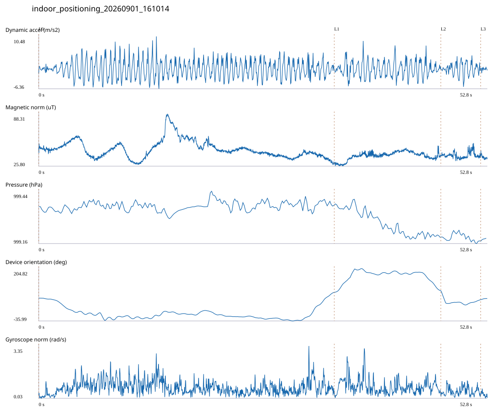

# 3F_IT_HALL / indoor_positioning_20260901_161014.jsonl

원본: `C:\Users\20222967\Documents\ChatGPT\자율설계 2\indoor\data\raw\2026-09-01\indoor_positioning_20260901_161014.jsonl`

SHA-256: `ad59f3afc69d5bdb4f86f149e8440deed38d49f81b1741cfffb44d158b84d551`

기존 분석: baseline summary/segments; special routes no path accuracy / 기존 상태: accepted_with_review

시간 52.823초 · 카운터 75.000 · 가속도 피크 후보(.7/1/1.3): {'0.7': 88, '1.0': 87, '1.3': 87}

방향 출처: `quaternion_device_yaw_not_walking_heading`. 휴대폰 회전 후보를 보행 회전으로 확정하지 않는다.

L0,L1…은 원본 라벨 시점이다. 표시 위치 정답이나 지도 경로가 아니다.

## 품질·한계

- Device orientation is not calibrated walking direction; no absolute map-path accuracy claim.
- Zero counter increments coexist with acceleration peaks; counter-only segment distance is unreliable.

## 센서 기록

|센서|샘플|동일 wall time|중앙 간격 ms|최대 공백 s|
|---|---:|---:|---:|---:|
|accelerometer_mps2|24150|3623|2.000|0.027|
|gyroscope_rads|2415|0|22.000|0.041|
|magnetic_field_ut|2642|0|20.000|0.033|
|pressure_hpa|330|0|160.000|0.170|
|rotation_vector|2415|4|21.000|0.044|
|step_counter|70|0|569.000|2.187|

## 랩 구간 분석

|구간|초|카운터|피크 후보|동적 RMS|B 평균±SD µT|기압차 hPa|기기방향 변화°|
|---|---:|---:|---:|---:|---|---:|---:|
|자유공간 IT홀 계단 아래 → IT홀 계단 아래|34.796|57.000|60|2.844|45.968 ± 10.492|0.019|26.380|
|IT홀 계단 아래 → IT홀 계단 위 회전점|12.543|18.000|20|2.558|38.255 ± 4.869|-0.152|7.635|
|IT홀 계단 위 회전점 → IT홀 입구|4.693|0.000|7|1.976|38.811 ± 3.701|-0.017|-40.950|
|IT홀 입구 → session_end (not position truth)|0.791|0.000|0|0.471|36.495 ± 2.379|0.016|5.123|

## 2초 창의 휴대폰 방향 변화 후보

|시점 s|방향 변화°|자이로 RMS|동시 피크 후보|
|---:|---:|---:|---:|
|1.903|-31.074|0.446|2|
|6.753|-30.529|1.028|3|
|13.853|30.188|1.270|3|
|31.103|30.392|0.928|3|
|33.103|81.904|1.040|4|
|35.103|66.514|0.871|2|
|37.103|59.617|1.126|3|
|45.003|-31.611|0.787|3|
|47.003|-107.274|0.673|3|

각도 변화30°/2초는 진단용 기준이다. 자세 변화·자기장 교란·축 정의 영향을 포함한다. 가속도 피크도 실제 걸음 정답이 아니다. 샘플 수는 물리 센서의 독립 관측 수와 같지 않다.
