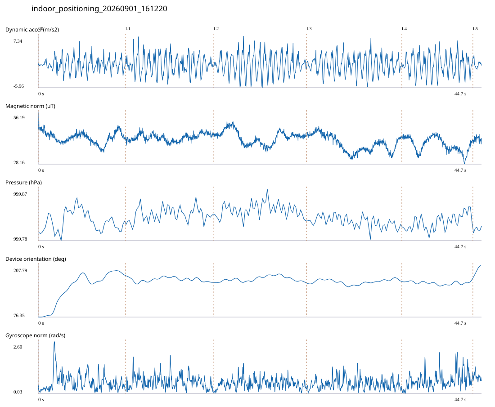

# 2F_CORE_TO_LEFT_STAIRS / indoor_positioning_20260901_161220.jsonl

원본: `C:\Users\20222967\Documents\ChatGPT\자율설계 2\indoor\data\raw\2026-09-01\indoor_positioning_20260901_161220.jsonl`

SHA-256: `c9f7e05bff22ee3d24b512867f2378fe713461bca866b3592509bb1599ea298d`

기존 분석: baseline summary/segments; special routes no path accuracy / 기존 상태: accepted

시간 44.708초 · 카운터 62.000 · 가속도 피크 후보(.7/1/1.3): {'0.7': 76, '1.0': 74, '1.3': 73}

방향 출처: `quaternion_device_yaw_not_walking_heading`. 휴대폰 회전 후보를 보행 회전으로 확정하지 않는다.

L0,L1…은 원본 라벨 시점이다. 표시 위치 정답이나 지도 경로가 아니다.

## 품질·한계

- Device orientation is not calibrated walking direction; no absolute map-path accuracy claim.

## 센서 기록

|센서|샘플|동일 wall time|중앙 간격 ms|최대 공백 s|
|---|---:|---:|---:|---:|
|accelerometer_mps2|20443|2491|2.000|0.027|
|gyroscope_rads|2045|0|22.000|0.036|
|magnetic_field_ut|2237|0|20.000|0.034|
|pressure_hpa|280|0|160.000|0.172|
|rotation_vector|2046|1|21.000|0.043|
|step_counter|52|0|569.000|5.811|

## 랩 구간 분석

|구간|초|카운터|피크 후보|동적 RMS|B 평균±SD µT|기압차 hPa|기기방향 변화°|
|---|---:|---:|---:|---:|---|---:|---:|
|코어복도 출구 중앙점 → 2119 앞|8.798|7.000|13|1.764|42.559 ± 3.148|0.005|105.797|
|2119 앞 → 2122 앞|8.906|15.000|16|2.466|42.615 ± 1.971|0.010|-17.602|
|2122 앞 → 2125 앞|9.369|15.000|16|2.804|42.777 ± 3.624|-0.001|-1.282|
|2125 앞 → 2128 앞|9.598|14.000|16|2.368|39.099 ± 4.421|-0.008|4.565|
|2128 앞 → 왼쪽 계단 입구|7.167|9.000|12|2.647|38.748 ± 3.922|0.021|7.254|
|왼쪽 계단 입구 → session_end (not position truth)|0.870|2.000|1|0.990|41.731 ± 1.387|0.004|31.891|

## 2초 창의 휴대폰 방향 변화 후보

|시점 s|방향 변화°|자이로 RMS|동시 피크 후보|
|---:|---:|---:|---:|
|1.002|42.645|0.879|2|
|3.002|54.674|0.722|3|
|6.302|30.875|0.636|4|
|8.752|-30.695|0.602|4|
|43.302|32.028|0.974|4|

각도 변화30°/2초는 진단용 기준이다. 자세 변화·자기장 교란·축 정의 영향을 포함한다. 가속도 피크도 실제 걸음 정답이 아니다. 샘플 수는 물리 센서의 독립 관측 수와 같지 않다.
