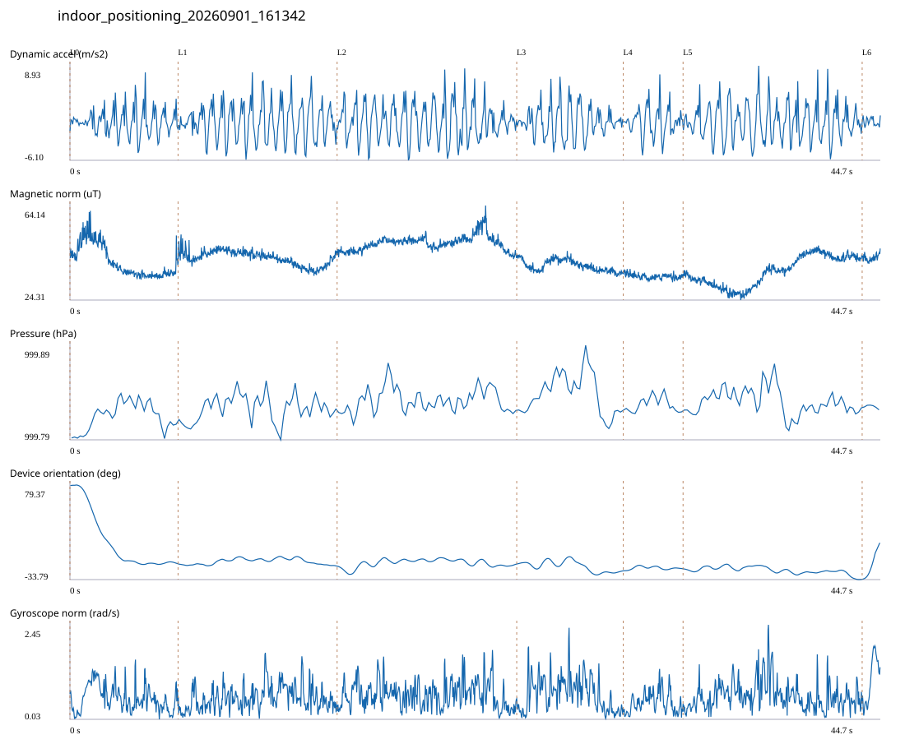

# 2F_CORE_TO_RIGHT_STAIRS / indoor_positioning_20260901_161342.jsonl

원본: `C:\Users\20222967\Documents\ChatGPT\자율설계 2\indoor\data\raw\2026-09-01\indoor_positioning_20260901_161342.jsonl`

SHA-256: `8b80774ecc2dc38f54be1f81b88c639e8bee49d1e57ab29fead426bd86cf0046`

기존 분석: baseline summary/segments; special routes no path accuracy / 기존 상태: accepted_with_review

시간 44.653초 · 카운터 65.000 · 가속도 피크 후보(.7/1/1.3): {'0.7': 78, '1.0': 75, '1.3': 72}

방향 출처: `quaternion_device_yaw_not_walking_heading`. 휴대폰 회전 후보를 보행 회전으로 확정하지 않는다.

L0,L1…은 원본 라벨 시점이다. 표시 위치 정답이나 지도 경로가 아니다.

## 품질·한계

- Device orientation is not calibrated walking direction; no absolute map-path accuracy claim.
- Zero counter increments coexist with acceleration peaks; counter-only segment distance is unreliable.

## 센서 기록

|센서|샘플|동일 wall time|중앙 간격 ms|최대 공백 s|
|---|---:|---:|---:|---:|
|accelerometer_mps2|20413|2584|2.000|0.024|
|gyroscope_rads|2042|0|22.000|0.039|
|magnetic_field_ut|2233|0|20.000|0.030|
|pressure_hpa|279|0|160.000|0.179|
|rotation_vector|2042|4|21.000|0.051|
|step_counter|54|0|548.000|6.608|

## 랩 구간 분석

|구간|초|카운터|피크 후보|동적 RMS|B 평균±SD µT|기압차 hPa|기기방향 변화°|
|---|---:|---:|---:|---:|---|---:|---:|
|코어복도 출구 중앙점 → 2211 앞|5.957|8.000|9|2.079|40.505 ± 6.711|0.012|-93.379|
|2211 앞 → 2210 앞|8.765|13.000|15|2.913|42.101 ± 3.040|0.015|-2.448|
|2210 앞 → 2210-1 앞|9.896|18.000|18|2.951|48.337 ± 3.178|0.004|2.309|
|2210-1 앞 → 2205 앞|5.869|7.000|9|2.488|38.824 ± 2.400|-0.010|-8.260|
|2205 앞 → 2204 앞|3.296|0.000|5|2.275|34.314 ± 1.084|-0.001|2.457|
|2204 앞 → 오른쪽 계단 입구|9.869|19.000|18|2.910|36.382 ± 6.183|-0.002|-12.495|
|오른쪽 계단 입구 → session_end (not position truth)|1.001|0.000|1|0.631|42.126 ± 1.435|-0.003|43.494|

## 2초 창의 휴대폰 방향 변화 후보

|시점 s|방향 변화°|자이로 RMS|동시 피크 후보|
|---:|---:|---:|---:|
|1.025|-65.467|0.790|2|
|43.575|30.593|0.921|3|

각도 변화30°/2초는 진단용 기준이다. 자세 변화·자기장 교란·축 정의 영향을 포함한다. 가속도 피크도 실제 걸음 정답이 아니다. 샘플 수는 물리 센서의 독립 관측 수와 같지 않다.
