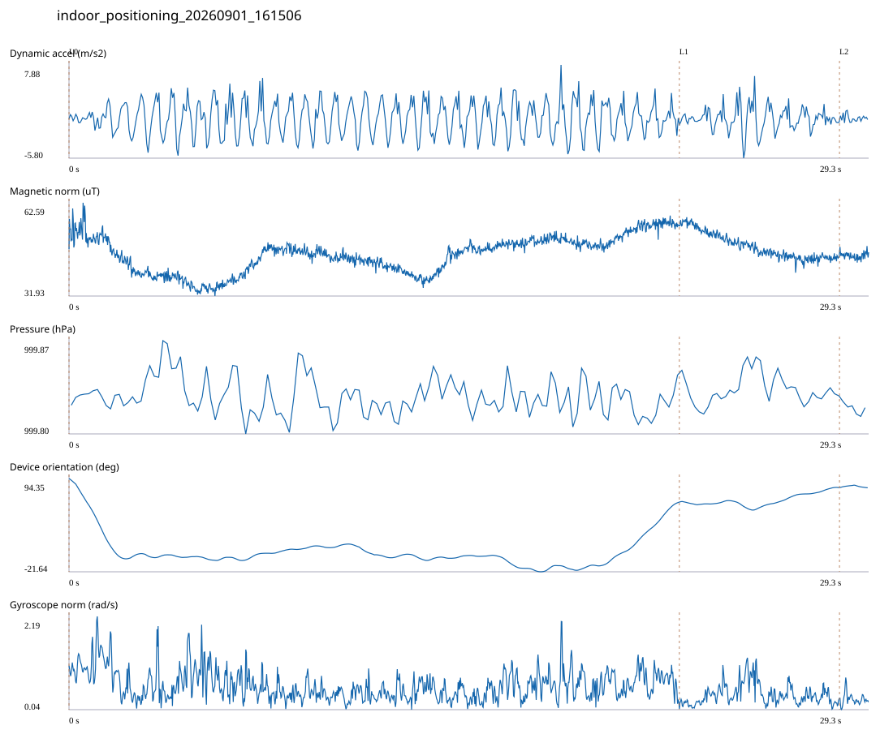

# 2F_2107_OPEN / indoor_positioning_20260901_161506.jsonl

원본: `C:\Users\20222967\Documents\ChatGPT\자율설계 2\indoor\data\raw\2026-09-01\indoor_positioning_20260901_161506.jsonl`

SHA-256: `d9ff3cdfb9ce44befdcf117d26b43c6d2bed27473b13c97c82a720d9934808e1`

기존 분석: baseline summary/segments; special routes no path accuracy / 기존 상태: accepted

시간 29.339초 · 카운터 44.000 · 가속도 피크 후보(.7/1/1.3): {'0.7': 48, '1.0': 47, '1.3': 46}

방향 출처: `quaternion_device_yaw_not_walking_heading`. 휴대폰 회전 후보를 보행 회전으로 확정하지 않는다.

L0,L1…은 원본 라벨 시점이다. 표시 위치 정답이나 지도 경로가 아니다.

## 품질·한계

- Device orientation is not calibrated walking direction; no absolute map-path accuracy claim.

## 센서 기록

|센서|샘플|동일 wall time|중앙 간격 ms|최대 공백 s|
|---|---:|---:|---:|---:|
|accelerometer_mps2|13412|2137|2.000|0.019|
|gyroscope_rads|1341|0|22.000|0.040|
|magnetic_field_ut|1468|0|20.000|0.036|
|pressure_hpa|183|0|160.000|0.170|
|rotation_vector|1341|3|21.000|0.044|
|step_counter|39|0|567.500|1.442|

## 랩 구간 분석

|구간|초|카운터|피크 후보|동적 RMS|B 평균±SD µT|기압차 hPa|기기방향 변화°|
|---|---:|---:|---:|---:|---|---:|---:|
|메인복도·2107 교차점 → 2107 입구|22.391|37.000|38|2.504|45.513 ± 5.980|-0.005|-29.795|
|2107 입구 → 2107 개방공간|5.875|7.000|8|1.750|48.260 ± 4.162|0.009|17.809|
|2107 개방공간 → session_end (not position truth)|1.073|0.000|1|0.508|45.240 ± 1.112|-0.004|-0.430|

## 2초 창의 휴대폰 방향 변화 후보

|시점 s|방향 변화°|자이로 RMS|동시 피크 후보|
|---:|---:|---:|---:|
|1.001|-99.501|1.108|1|
|19.751|30.966|0.643|3|
|21.751|51.603|0.724|3|

각도 변화30°/2초는 진단용 기준이다. 자세 변화·자기장 교란·축 정의 영향을 포함한다. 가속도 피크도 실제 걸음 정답이 아니다. 샘플 수는 물리 센서의 독립 관측 수와 같지 않다.
