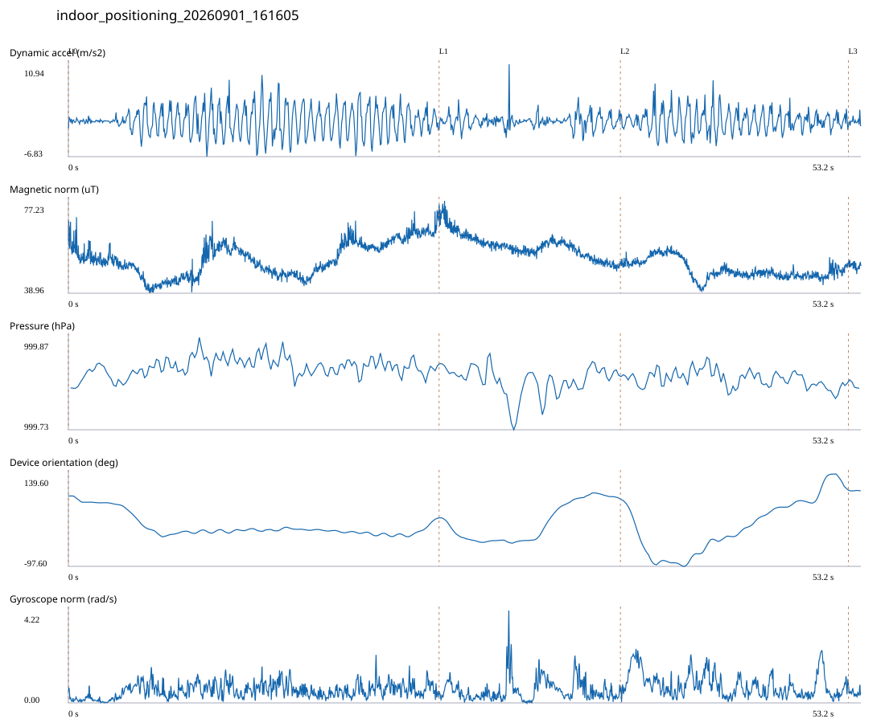

# 2F_STUDY / indoor_positioning_20260901_161605.jsonl

원본: `C:\Users\20222967\Documents\ChatGPT\자율설계 2\indoor\data\raw\2026-09-01\indoor_positioning_20260901_161605.jsonl`

SHA-256: `0b43b5401776ab3044c9047b7434910fce2d87bccb5fada26045520b1e1588af`

기존 분석: baseline summary/segments; special routes no path accuracy / 기존 상태: accepted

시간 53.228초 · 카운터 58.000 · 가속도 피크 후보(.7/1/1.3): {'0.7': 86, '1.0': 82, '1.3': 77}

방향 출처: `quaternion_device_yaw_not_walking_heading`. 휴대폰 회전 후보를 보행 회전으로 확정하지 않는다.

L0,L1…은 원본 라벨 시점이다. 표시 위치 정답이나 지도 경로가 아니다.

## 품질·한계

- Legacy 2107 labels: may include return via corridor; do not assume labels are wrong or a direct wall crossing. Actual detour timing unresolved.
- Device orientation is not calibrated walking direction; no absolute map-path accuracy claim.
- Zero counter increments coexist with acceleration peaks; counter-only segment distance is unreliable.

## 센서 기록

|센서|샘플|동일 wall time|중앙 간격 ms|최대 공백 s|
|---|---:|---:|---:|---:|
|accelerometer_mps2|24328|3592|2.000|0.021|
|gyroscope_rads|2432|0|22.000|0.041|
|magnetic_field_ut|2662|0|20.000|0.030|
|pressure_hpa|332|0|160.000|0.171|
|rotation_vector|2432|9|21.000|0.046|
|step_counter|48|0|564.000|15.211|

## 랩 구간 분석

|구간|초|카운터|피크 후보|동적 RMS|B 평균±SD µT|기압차 hPa|기기방향 변화°|
|---|---:|---:|---:|---:|---|---:|---:|
|메인복도·2107 교차점 → 2107 입구|24.896|37.000|40|2.731|53.222 ± 7.097|0.014|-56.349|
|2107 입구 → 2107 개방공간|12.178|3.000|14|1.426|58.484 ± 4.999|0.002|48.980|
|2107 개방공간 → ㄷ자 학습공간|15.313|18.000|26|2.103|48.757 ± 3.894|-0.014|24.004|
|ㄷ자 학습공간 → session_end (not position truth)|0.841|0.000|2|0.714|50.357 ± 1.295|-0.013|-1.323|

## 2초 창의 휴대폰 방향 변화 후보

|시점 s|방향 변화°|자이로 RMS|동시 피크 후보|
|---:|---:|---:|---:|
|3.359|-31.548|0.432|2|
|5.359|-55.824|0.819|4|
|23.409|32.255|0.748|3|
|25.409|-39.590|0.690|3|
|30.859|32.769|0.714|1|
|32.859|77.109|0.740|1|
|36.559|-31.359|0.529|3|
|38.559|-149.830|1.550|4|
|41.659|30.085|1.005|3|
|43.659|37.044|1.020|4|
|45.659|53.255|0.766|4|
|47.659|30.834|0.731|3|
|49.659|50.704|0.988|3|
|51.859|-32.782|0.548|4|

각도 변화30°/2초는 진단용 기준이다. 자세 변화·자기장 교란·축 정의 영향을 포함한다. 가속도 피크도 실제 걸음 정답이 아니다. 샘플 수는 물리 센서의 독립 관측 수와 같지 않다.
