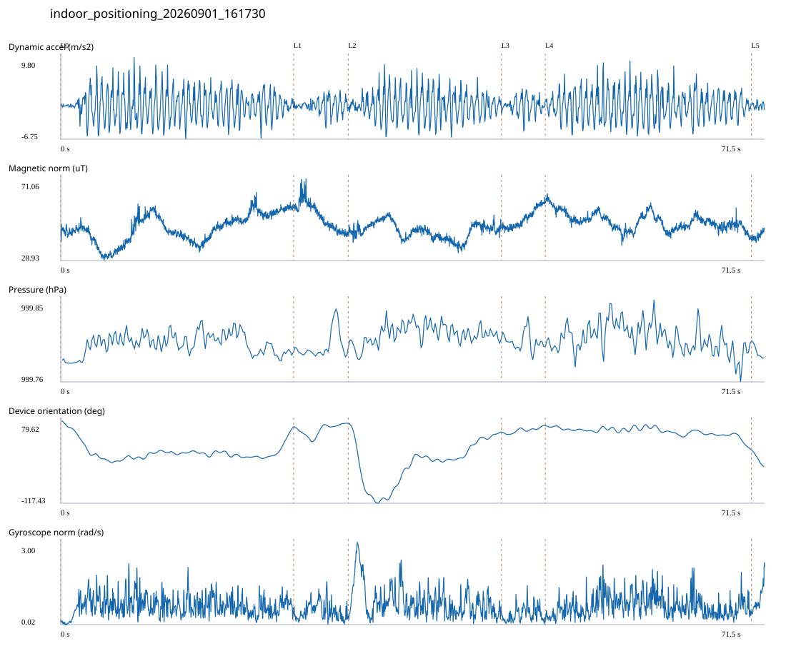

# 2F_EXTENSION / indoor_positioning_20260901_161730.jsonl

원본: `C:\Users\20222967\Documents\ChatGPT\자율설계 2\indoor\data\raw\2026-09-01\indoor_positioning_20260901_161730.jsonl`

SHA-256: `63d8955297fa838cce594367136baae4b38c65987aa0ebe7b1b95eb31781bcfe`

기존 분석: baseline summary/segments; special routes no path accuracy / 기존 상태: accepted_with_review

시간 71.536초 · 카운터 103.000 · 가속도 피크 후보(.7/1/1.3): {'0.7': 119, '1.0': 118, '1.3': 116}

방향 출처: `quaternion_device_yaw_not_walking_heading`. 휴대폰 회전 후보를 보행 회전으로 확정하지 않는다.

L0,L1…은 원본 라벨 시점이다. 표시 위치 정답이나 지도 경로가 아니다.

## 품질·한계

- Legacy 2107 labels: may include return via corridor; do not assume labels are wrong or a direct wall crossing. Actual detour timing unresolved.
- Device orientation is not calibrated walking direction; no absolute map-path accuracy claim.
- Zero counter increments coexist with acceleration peaks; counter-only segment distance is unreliable.

## 센서 기록

|센서|샘플|동일 wall time|중앙 간격 ms|최대 공백 s|
|---|---:|---:|---:|---:|
|accelerometer_mps2|32699|4817|2.000|0.029|
|gyroscope_rads|3270|0|22.000|0.043|
|magnetic_field_ut|3578|1|20.000|0.040|
|pressure_hpa|447|0|160.000|0.177|
|rotation_vector|3269|5|21.000|0.057|
|step_counter|88|0|569.000|8.164|

## 랩 구간 분석

|구간|초|카운터|피크 후보|동적 RMS|B 평균±SD µT|기압차 hPa|기기방향 변화°|
|---|---:|---:|---:|---:|---|---:|---:|
|메인복도·2107 교차점 → 2107 입구|23.668|37.000|40|2.968|45.471 ± 7.247|0.005|-14.473|
|2107 입구 → 2107 개방공간|5.553|0.000|7|1.433|51.636 ± 6.929|0.004|8.343|
|2107 개방공간 → TDM 앞|15.572|27.000|27|2.737|44.011 ± 4.158|0.009|-20.654|
|TDM 앞 → 증축부 입구|4.454|0.000|6|1.638|50.609 ± 4.857|-0.004|15.412|
|증축부 입구 → 증축부 복도 끝|20.949|39.000|37|2.924|48.980 ± 4.410|-0.009|-57.660|
|증축부 복도 끝 → session_end (not position truth)|1.340|0.000|1|0.605|41.704 ± 1.918|-0.020|-39.637|

## 2초 창의 휴대폰 방향 변화 후보

|시점 s|방향 변화°|자이로 RMS|동시 피크 후보|
|---:|---:|---:|---:|
|1.034|-43.981|0.475|1|
|3.034|-44.909|0.961|3|
|21.534|30.286|0.666|4|
|23.534|31.849|0.639|2|
|26.334|30.806|0.777|4|
|28.934|-31.673|0.773|3|
|30.934|-149.282|1.696|3|
|32.934|33.721|0.982|3|
|34.934|77.772|1.085|4|
|40.584|30.255|0.783|3|
|68.984|-31.401|0.754|3|

각도 변화30°/2초는 진단용 기준이다. 자세 변화·자기장 교란·축 정의 영향을 포함한다. 가속도 피크도 실제 걸음 정답이 아니다. 샘플 수는 물리 센서의 독립 관측 수와 같지 않다.
