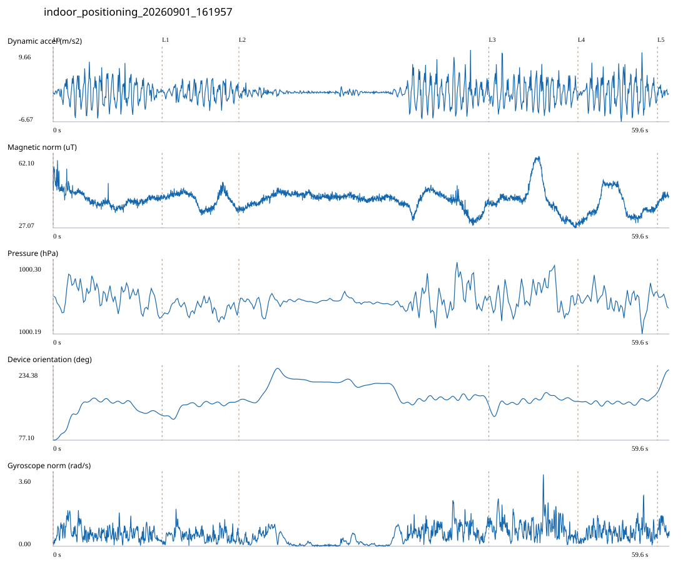

# 1F_CORE_TO_LEFT_STAIRS / indoor_positioning_20260901_161957.jsonl

원본: `C:\Users\20222967\Documents\ChatGPT\자율설계 2\indoor\data\raw\2026-09-01\indoor_positioning_20260901_161957.jsonl`

SHA-256: `cb5bc51c8a6f653dcf4bb7f00c3fdf3fe34db6e9043539ff3e2f9904fc42a470`

기존 분석: baseline summary/segments; special routes no path accuracy / 기존 상태: accepted

시간 59.646초 · 카운터 62.000 · 가속도 피크 후보(.7/1/1.3): {'0.7': 81, '1.0': 76, '1.3': 73}

방향 출처: `quaternion_device_yaw_not_walking_heading`. 휴대폰 회전 후보를 보행 회전으로 확정하지 않는다.

L0,L1…은 원본 라벨 시점이다. 표시 위치 정답이나 지도 경로가 아니다.

## 품질·한계

- Device orientation is not calibrated walking direction; no absolute map-path accuracy claim.

## 센서 기록

|센서|샘플|동일 wall time|중앙 간격 ms|최대 공백 s|
|---|---:|---:|---:|---:|
|accelerometer_mps2|27266|3496|2.000|0.020|
|gyroscope_rads|2727|0|22.000|0.041|
|magnetic_field_ut|2983|0|20.000|0.038|
|pressure_hpa|373|0|160.000|0.172|
|rotation_vector|2727|7|21.000|0.055|
|step_counter|52|0|569.000|19.889|

## 랩 구간 분석

|구간|초|카운터|피크 후보|동적 RMS|B 평균±SD µT|기압차 hPa|기기방향 변화°|
|---|---:|---:|---:|---:|---|---:|---:|
|코어복도 출구 중앙점 → 1119 앞|10.547|14.000|16|2.537|41.542 ± 3.943|-0.017|54.533|
|1119 앞 → 1122 앞|7.431|10.000|11|1.661|40.945 ± 3.624|0.003|32.418|
|1122 앞 → 1125 앞|24.197|14.000|20|1.826|40.675 ± 3.629|0.004|-9.755|
|1125 앞 → 1128 앞|8.624|13.000|15|2.761|40.910 ± 8.412|-0.012|10.310|
|1128 앞 → 왼쪽 계단 입구|7.706|10.000|13|2.924|37.839 ± 6.396|0.004|20.172|
|왼쪽 계단 입구 → session_end (not position truth)|1.141|1.000|1|0.763|41.793 ± 1.588|-0.017|47.988|

## 2초 창의 휴대폰 방향 변화 후보

|시점 s|방향 변화°|자이로 RMS|동시 피크 후보|
|---:|---:|---:|---:|
|1.003|57.242|0.940|2|
|3.003|34.674|0.790|3|
|12.303|30.291|0.736|3|
|19.803|31.584|0.525|2|
|32.453|-31.691|0.466|0|
|41.453|-31.428|0.854|3|
|57.803|30.451|0.898|4|

각도 변화30°/2초는 진단용 기준이다. 자세 변화·자기장 교란·축 정의 영향을 포함한다. 가속도 피크도 실제 걸음 정답이 아니다. 샘플 수는 물리 센서의 독립 관측 수와 같지 않다.
