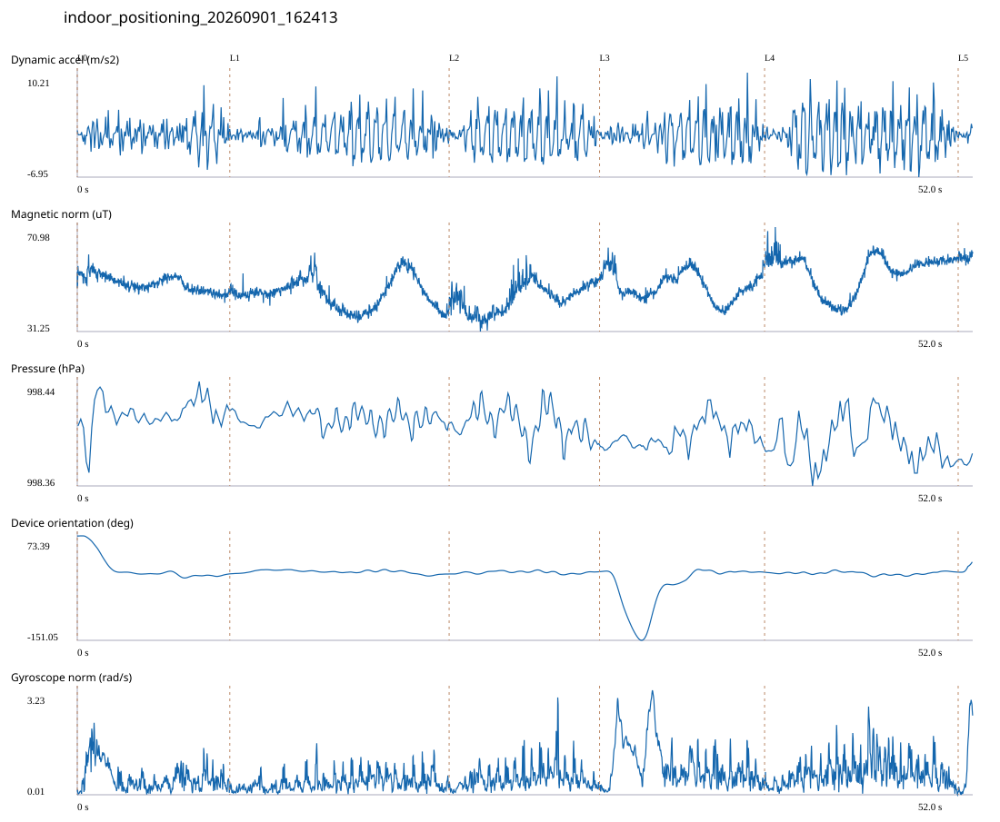

# 5F_CORE_TO_RIGHT_STAIRS / indoor_positioning_20260901_162413.jsonl

원본: `C:\Users\20222967\Documents\ChatGPT\자율설계 2\indoor\data\raw\2026-09-01\indoor_positioning_20260901_162413.jsonl`

SHA-256: `656861d10f1ed935228397324c9464e5f156137a7bd62a1529ee66b682b4a3d0`

기존 분석: baseline summary/segments; special routes no path accuracy / 기존 상태: accepted_with_review

시간 51.983초 · 카운터 60.000 · 가속도 피크 후보(.7/1/1.3): {'0.7': 96, '1.0': 94, '1.3': 89}

방향 출처: `quaternion_device_yaw_not_walking_heading`. 휴대폰 회전 후보를 보행 회전으로 확정하지 않는다.

L0,L1…은 원본 라벨 시점이다. 표시 위치 정답이나 지도 경로가 아니다.

## 품질·한계

- Device orientation is not calibrated walking direction; no absolute map-path accuracy claim.
- Zero counter increments coexist with acceleration peaks; counter-only segment distance is unreliable.

## 센서 기록

|센서|샘플|동일 wall time|중앙 간격 ms|최대 공백 s|
|---|---:|---:|---:|---:|
|accelerometer_mps2|23771|2403|2.000|0.022|
|gyroscope_rads|2378|0|22.000|0.038|
|magnetic_field_ut|2601|1|20.000|0.039|
|pressure_hpa|450|0|81.000|0.188|
|rotation_vector|2379|5|21.000|0.059|
|step_counter|40|0|504.000|7.588|

## 랩 구간 분석

|구간|초|카운터|피크 후보|동적 RMS|B 평균±SD µT|기압차 hPa|기기방향 변화°|
|---|---:|---:|---:|---:|---|---:|---:|
|코어복도 출구 중앙점 → 5213 앞|8.854|0.000|15|1.857|49.558 ± 2.953|0.007|-81.380|
|5213 앞 → 5212 앞|12.733|18.000|21|2.346|45.782 ± 5.741|-0.003|-0.447|
|5212 앞 → 5209 앞|8.732|14.000|17|2.833|44.270 ± 5.386|-0.013|4.851|
|5209 앞 → 5205 앞|9.579|10.000|19|2.560|48.666 ± 5.236|0.012|-1.029|
|5205 앞 → 오른쪽 계단 입구|11.237|18.000|21|3.349|53.862 ± 6.981|-0.004|0.223|
|오른쪽 계단 입구 → session_end (not position truth)|0.848|0.000|1|0.682|59.551 ± 1.448|0.005|21.924|

## 2초 창의 휴대폰 방향 변화 후보

|시점 s|방향 변화°|자이로 RMS|동시 피크 후보|
|---:|---:|---:|---:|
|1.001|-71.327|1.106|2|
|30.401|-35.303|0.859|4|
|32.401|-50.117|1.741|3|
|34.401|72.716|1.234|4|

각도 변화30°/2초는 진단용 기준이다. 자세 변화·자기장 교란·축 정의 영향을 포함한다. 가속도 피크도 실제 걸음 정답이 아니다. 샘플 수는 물리 센서의 독립 관측 수와 같지 않다.
