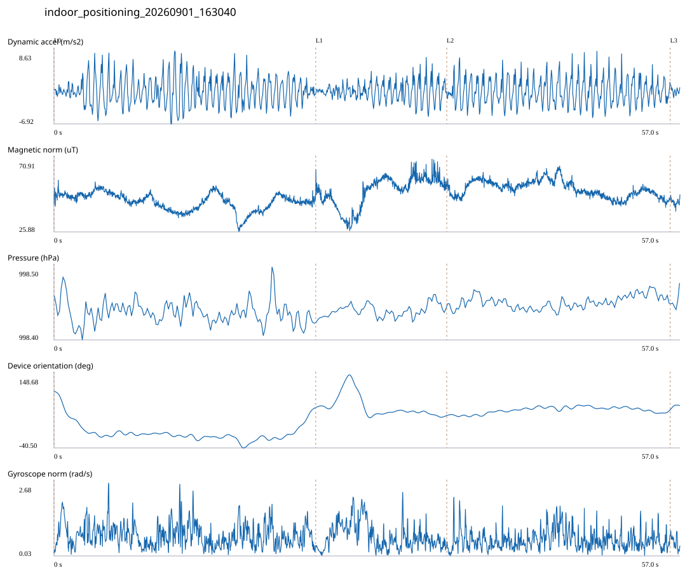

# 5F_OUTDOOR / indoor_positioning_20260901_163040.jsonl

원본: `C:\Users\20222967\Documents\ChatGPT\자율설계 2\indoor\data\raw\2026-09-01\indoor_positioning_20260901_163040.jsonl`

SHA-256: `e2b6115367e0e30151381b0ebc627180bc2e1906e638b8e746a13aaafef0ccdc`

기존 분석: baseline summary/segments; special routes no path accuracy / 기존 상태: accepted_with_review

시간 57.028초 · 카운터 77.000 · 가속도 피크 후보(.7/1/1.3): {'0.7': 100, '1.0': 99, '1.3': 97}

방향 출처: `quaternion_device_yaw_not_walking_heading`. 휴대폰 회전 후보를 보행 회전으로 확정하지 않는다.

L0,L1…은 원본 라벨 시점이다. 표시 위치 정답이나 지도 경로가 아니다.

## 품질·한계

- Device orientation is not calibrated walking direction; no absolute map-path accuracy claim.
- Zero counter increments coexist with acceleration peaks; counter-only segment distance is unreliable.

## 센서 기록

|센서|샘플|동일 wall time|중앙 간격 ms|최대 공백 s|
|---|---:|---:|---:|---:|
|accelerometer_mps2|26075|3084|2.000|0.021|
|gyroscope_rads|2608|0|22.000|0.041|
|magnetic_field_ut|2852|0|20.000|0.035|
|pressure_hpa|357|0|160.000|0.172|
|rotation_vector|2608|3|21.000|0.057|
|step_counter|61|0|568.000|16.087|

## 랩 구간 분석

|구간|초|카운터|피크 후보|동적 RMS|B 평균±SD µT|기압차 hPa|기기방향 변화°|
|---|---:|---:|---:|---:|---|---:|---:|
|오른쪽 복도 야외문 → 야외공간 입구|23.837|36.000|43|2.942|44.434 ± 5.407|-0.000|-42.112|
|야외공간 입구 → 야외공간 중앙|11.934|0.000|20|2.016|50.914 ± 9.593|0.016|-20.877|
|야외공간 중앙 → 야외공간 끝|20.355|40.000|36|2.812|52.369 ± 5.034|0.009|13.680|
|야외공간 끝 → session_end (not position truth)|0.902|1.000|0|0.731|44.345 ± 1.861|0.028|10.032|

## 2초 창의 휴대폰 방향 변화 후보

|시점 s|방향 변화°|자이로 RMS|동시 피크 후보|
|---:|---:|---:|---:|
|1.003|-74.026|0.972|3|
|3.003|-39.598|0.966|4|
|21.353|30.323|0.663|3|
|23.353|54.213|0.747|3|
|25.353|55.106|0.925|3|
|27.353|-67.795|1.391|4|

각도 변화30°/2초는 진단용 기준이다. 자세 변화·자기장 교란·축 정의 영향을 포함한다. 가속도 피크도 실제 걸음 정답이 아니다. 샘플 수는 물리 센서의 독립 관측 수와 같지 않다.
