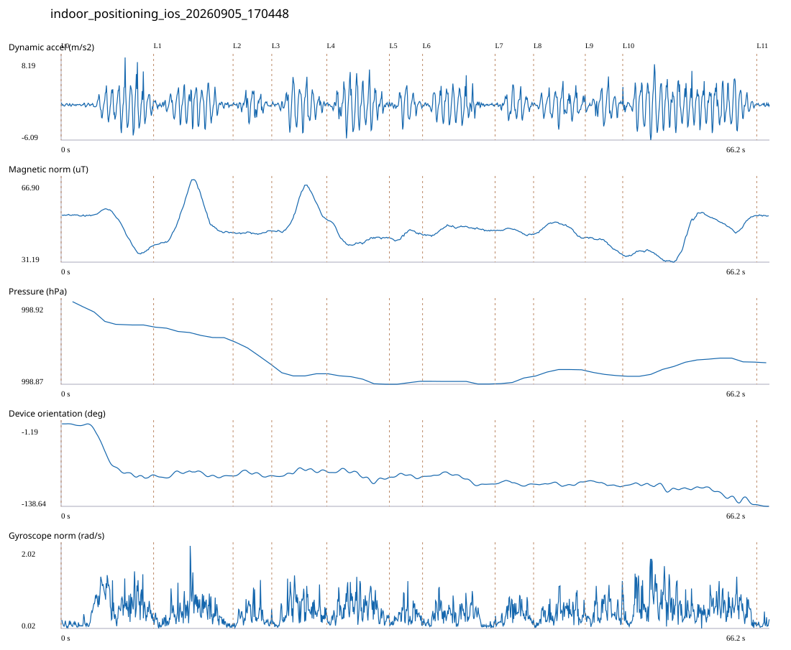

# 4F_CORE_TO_RIGHT_STAIRS / indoor_positioning_ios_20260905_170448.jsonl

원본: `C:\Users\20222967\Documents\ChatGPT\자율설계 2\indoor\data\raw\ios\2026-09-05\indoor_positioning_ios_20260905_170448.jsonl`

SHA-256: `160f26a38538f7440014f631790e1b90cafdd0b3530a896b66368fe60eaaa861`

기존 분석: 4F repeated multi-sensor analysis / 기존 상태: accepted

시간 66.262초 · 카운터 66.000 · 가속도 피크 후보(.7/1/1.3): {'0.7': 80, '1.0': 78, '1.3': 78}

방향 출처: `ios_alpha_device_orientation_not_walking_heading`. 휴대폰 회전 후보를 보행 회전으로 확정하지 않는다.

L0,L1…은 원본 라벨 시점이다. 표시 위치 정답이나 지도 경로가 아니다.

## 품질·한계

- Device orientation is not calibrated walking direction; no absolute map-path accuracy claim.
- Zero counter increments coexist with acceleration peaks; counter-only segment distance is unreliable.

## 센서 기록

|센서|샘플|동일 wall time|중앙 간격 ms|최대 공백 s|
|---|---:|---:|---:|---:|
|accelerometer_mps2|1332|0|50.000|0.080|
|device_motion_rotation_rads|1330|0|50.000|0.083|
|gyroscope_rads|1331|0|50.000|0.081|
|magnetic_field_ut|665|0|100.000|0.132|
|pressure_hpa|61|0|1075.000|1.512|
|step_counter|25|3|2548.000|5.112|

## 랩 구간 분석

|구간|초|카운터|피크 후보|동적 RMS|B 평균±SD µT|기압차 hPa|기기방향 변화°|
|---|---:|---:|---:|---:|---|---:|---:|
|코어복도 출구 중앙점 → 4213 앞|8.647|1.000|9|1.955|47.162 ± 6.737|-0.014|-84.901|
|4213 앞 → 4212 앞|7.432|13.000|8|1.678|49.457 ± 8.798|-0.006|-1.677|
|4212 앞 → 4211 앞|3.617|0.000|3|1.140|43.886 ± 0.407|-0.013|0.521|
|4211 앞 → 4210 앞|5.150|1.000|6|1.933|52.962 ± 7.011|-0.001|6.901|
|4210 앞 → 4209 앞|5.850|9.000|8|2.308|41.899 ± 3.093|-0.006|-9.446|
|4209 앞 → 4208 앞|3.102|2.000|3|1.460|42.872 ± 1.570|0.002|1.225|
|4208 앞 → 4207 앞|6.783|5.000|7|1.587|45.244 ± 1.352|-0.002|-12.510|
|4207 앞 → 4206 앞|3.600|4.000|4|1.351|44.522 ± 0.995|0.003|-0.300|
|4206 앞 → 4205 앞|4.834|0.000|7|1.550|45.680 ± 2.229|0.004|4.038|
|4205 앞 → 4204 앞|3.500|10.000|3|1.535|39.356 ± 2.399|-0.002|-7.559|
|4204 앞 → 오른쪽 계단 입구|12.533|17.000|20|2.462|41.932 ± 7.534|0.009|-30.933|
|오른쪽 계단 입구 → session_end (not position truth)|1.214|4.000|0|0.161|51.319 ± 0.172|0.000|-2.553|

## 2초 창의 휴대폰 방향 변화 후보

|시점 s|방향 변화°|자이로 RMS|동시 피크 후보|
|---:|---:|---:|---:|
|2.827|-31.392|0.572|1|
|4.827|-47.561|0.747|3|

각도 변화30°/2초는 진단용 기준이다. 자세 변화·자기장 교란·축 정의 영향을 포함한다. 가속도 피크도 실제 걸음 정답이 아니다. 샘플 수는 물리 센서의 독립 관측 수와 같지 않다.
