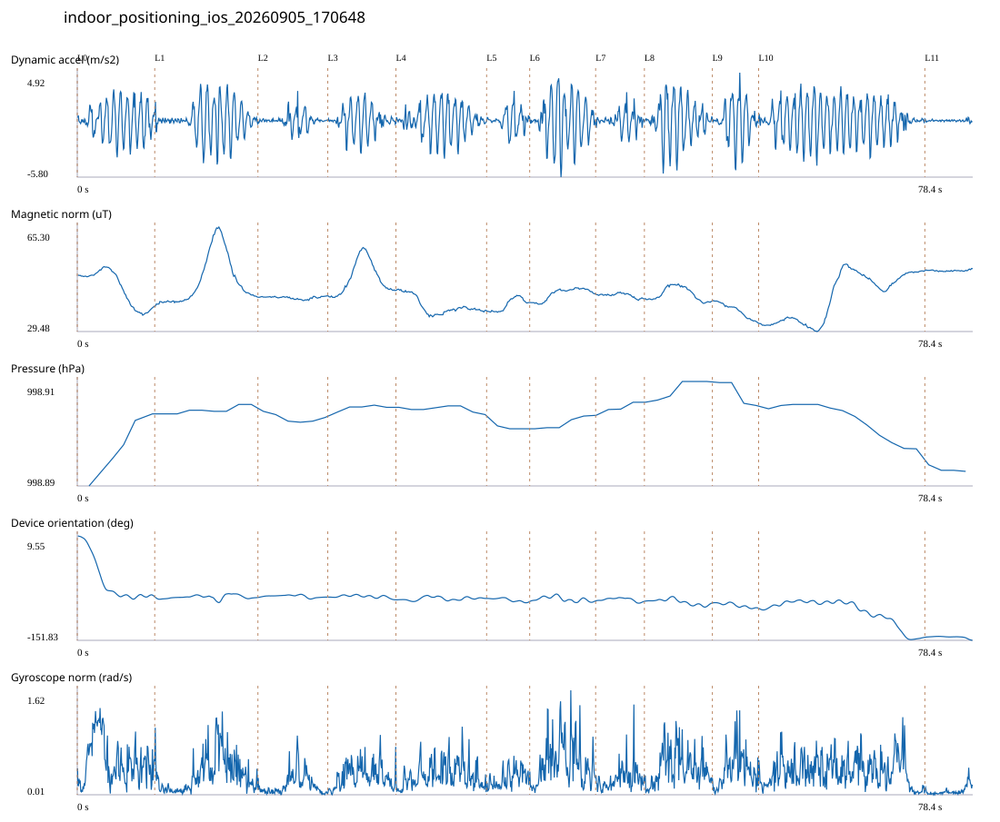

# 4F_CORE_TO_RIGHT_STAIRS / indoor_positioning_ios_20260905_170648.jsonl

원본: `C:\Users\20222967\Documents\ChatGPT\자율설계 2\indoor\data\raw\ios\2026-09-05\indoor_positioning_ios_20260905_170648.jsonl`

SHA-256: `72994a78fff96b93e1d8436252a15045c5debc40b5cccad238f3b2474581bd0b`

기존 분석: 4F repeated multi-sensor analysis / 기존 상태: accepted_with_pedometer_review

시간 78.393초 · 카운터 43.000 · 가속도 피크 후보(.7/1/1.3): {'0.7': 86, '1.0': 80, '1.3': 78}

방향 출처: `ios_alpha_device_orientation_not_walking_heading`. 휴대폰 회전 후보를 보행 회전으로 확정하지 않는다.

L0,L1…은 원본 라벨 시점이다. 표시 위치 정답이나 지도 경로가 아니다.

## 품질·한계

- Device orientation is not calibrated walking direction; no absolute map-path accuracy claim.
- Zero counter increments coexist with acceleration peaks; counter-only segment distance is unreliable.

## 센서 기록

|센서|샘플|동일 wall time|중앙 간격 ms|최대 공백 s|
|---|---:|---:|---:|---:|
|accelerometer_mps2|1575|0|50.000|0.079|
|device_motion_rotation_rads|1575|1|50.000|0.100|
|gyroscope_rads|1576|0|50.000|0.077|
|magnetic_field_ut|788|0|100.000|0.149|
|pressure_hpa|72|0|1075.000|1.512|
|step_counter|31|0|2548.000|5.099|

## 랩 구간 분석

|구간|초|카운터|피크 후보|동적 RMS|B 평균±SD µT|기압차 hPa|기기방향 변화°|
|---|---:|---:|---:|---:|---|---:|---:|
|코어복도 출구 중앙점 → 4213 앞|6.781|7.000|9|1.622|44.478 ± 5.969|0.015|-93.672|
|4213 앞 → 4212 앞|9.032|8.000|9|1.634|46.808 ± 8.258|0.002|-0.704|
|4212 앞 → 4211 앞|6.115|0.000|3|0.660|41.075 ± 0.421|-0.001|0.461|
|4211 앞 → 4210 앞|5.968|0.000|5|1.219|47.885 ± 5.543|0.001|-4.159|
|4210 앞 → 4209 앞|7.937|0.000|9|1.434|38.264 ± 2.921|-0.002|2.172|
|4209 앞 → 4208 앞|3.771|8.000|3|0.959|38.704 ± 2.160|-0.001|-5.266|
|4208 앞 → 4207 앞|5.773|0.000|8|2.205|42.340 ± 1.976|0.003|0.791|
|4207 앞 → 4206 앞|4.268|0.000|3|0.855|41.871 ± 0.717|0.003|-0.960|
|4206 앞 → 4205 앞|5.950|0.000|7|1.907|42.366 ± 2.250|0.004|-2.758|
|4205 앞 → 4204 앞|4.049|0.000|5|1.853|36.701 ± 2.426|-0.005|-7.952|
|4204 앞 → 오른쪽 계단 입구|14.551|16.000|19|1.747|41.295 ± 8.045|-0.009|-44.843|
|오른쪽 계단 입구 → session_end (not position truth)|4.198|4.000|0|0.095|50.377 ± 0.242|-0.001|-4.755|

## 2초 창의 휴대폰 방향 변화 후보

|시점 s|방향 변화°|자이로 RMS|동시 피크 후보|
|---:|---:|---:|---:|
|1.056|-63.115|0.788|2|
|71.356|-30.769|0.546|2|

각도 변화30°/2초는 진단용 기준이다. 자세 변화·자기장 교란·축 정의 영향을 포함한다. 가속도 피크도 실제 걸음 정답이 아니다. 샘플 수는 물리 센서의 독립 관측 수와 같지 않다.
