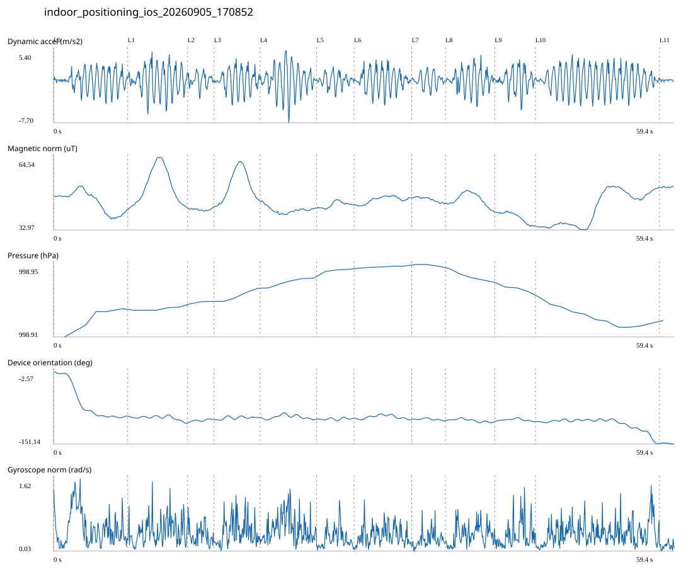

# 4F_CORE_TO_RIGHT_STAIRS / indoor_positioning_ios_20260905_170852.jsonl

원본: `C:\Users\20222967\Documents\ChatGPT\자율설계 2\indoor\data\raw\ios\2026-09-05\indoor_positioning_ios_20260905_170852.jsonl`

SHA-256: `8f221a8985cc44f1cfb5252ba69b0e0ec5ff08c040981d5fd10537cf2b6777ba`

기존 분석: 4F repeated multi-sensor analysis / 기존 상태: accepted

시간 59.436초 · 카운터 70.000 · 가속도 피크 후보(.7/1/1.3): {'0.7': 83, '1.0': 79, '1.3': 77}

방향 출처: `ios_alpha_device_orientation_not_walking_heading`. 휴대폰 회전 후보를 보행 회전으로 확정하지 않는다.

L0,L1…은 원본 라벨 시점이다. 표시 위치 정답이나 지도 경로가 아니다.

## 품질·한계

- Device orientation is not calibrated walking direction; no absolute map-path accuracy claim.
- Zero counter increments coexist with acceleration peaks; counter-only segment distance is unreliable.

## 센서 기록

|센서|샘플|동일 wall time|중앙 간격 ms|최대 공백 s|
|---|---:|---:|---:|---:|
|accelerometer_mps2|1194|0|50.000|0.078|
|device_motion_rotation_rads|1194|0|50.000|0.083|
|gyroscope_rads|1195|0|50.000|0.096|
|magnetic_field_ut|597|0|100.000|0.131|
|pressure_hpa|54|0|1075.000|1.522|
|step_counter|23|1|2548.000|5.073|

## 랩 구간 분석

|구간|초|카운터|피크 후보|동적 RMS|B 평균±SD µT|기압차 hPa|기기방향 변화°|
|---|---:|---:|---:|---:|---|---:|---:|
|코어복도 출구 중앙점 → 4213 앞|7.101|9.000|9|1.721|45.251 ± 4.565|0.012|-91.395|
|4213 앞 → 4212 앞|5.732|6.000|10|2.395|51.718 ± 7.650|0.001|-14.478|
|4212 앞 → 4211 앞|2.534|4.000|2|1.163|41.839 ± 0.421|0.001|6.971|
|4211 앞 → 4210 앞|4.414|4.000|7|1.923|52.098 ± 6.662|0.006|4.732|
|4210 앞 → 4209 앞|5.417|7.000|8|2.465|41.692 ± 1.437|0.004|-3.661|
|4209 앞 → 4208 앞|3.586|5.000|4|1.151|43.942 ± 1.294|0.001|1.857|
|4208 앞 → 4207 앞|5.517|3.000|7|1.840|46.080 ± 1.493|0.001|-2.846|
|4207 앞 → 4206 앞|3.232|0.000|3|1.212|46.224 ± 1.014|-0.001|-2.663|
|4206 앞 → 4205 앞|4.716|9.000|6|1.885|46.193 ± 2.784|-0.006|-1.901|
|4205 앞 → 4204 앞|3.902|5.000|5|1.864|38.493 ± 2.349|-0.002|-0.428|
|4204 앞 → 오른쪽 계단 입구|11.883|18.000|18|2.196|42.250 ± 7.348|-0.010|-44.857|
|오른쪽 계단 입구 → session_end (not position truth)|1.402|0.000|0|0.151|51.605 ± 0.210|0.000|-1.313|

## 2초 창의 휴대폰 방향 변화 후보

|시점 s|방향 변화°|자이로 RMS|동시 피크 후보|
|---:|---:|---:|---:|
|1.046|-38.316|0.681|1|
|3.046|-50.312|0.777|3|
|56.596|-30.300|0.623|3|

각도 변화30°/2초는 진단용 기준이다. 자세 변화·자기장 교란·축 정의 영향을 포함한다. 가속도 피크도 실제 걸음 정답이 아니다. 샘플 수는 물리 센서의 독립 관측 수와 같지 않다.
