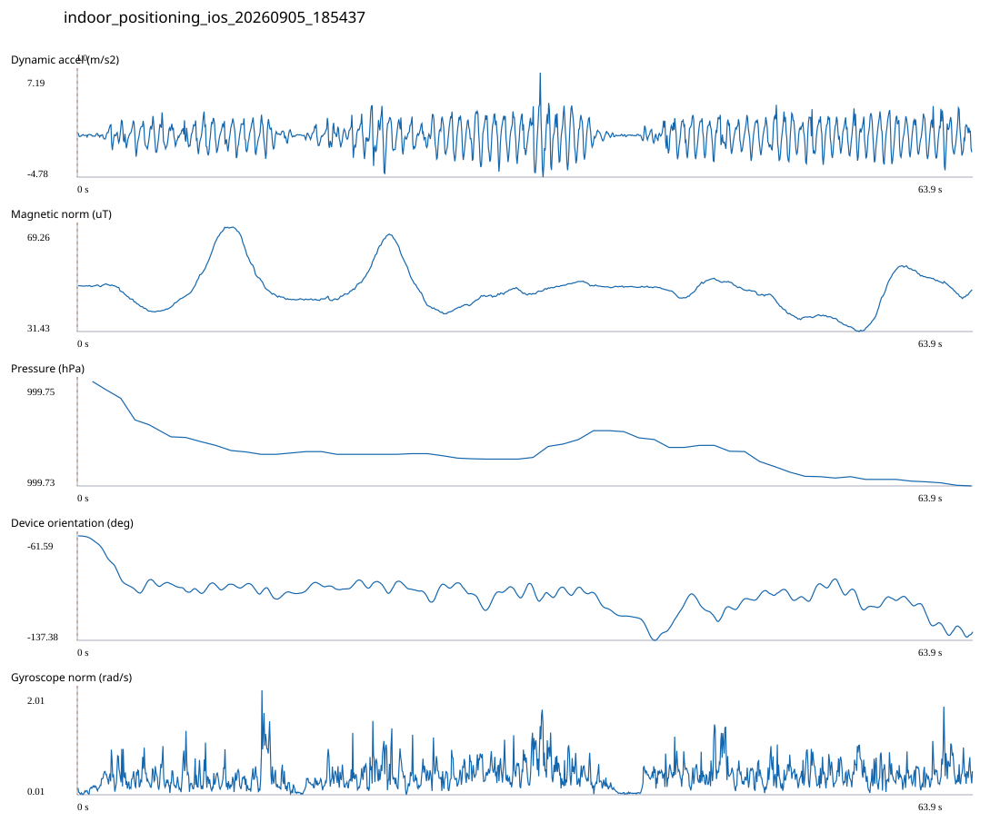

# AUTO_4F_CORE / indoor_positioning_ios_20260905_185437.jsonl

원본: `C:\Users\20222967\Documents\카카오톡 받은 파일\indoor_positioning_ios_20260905_185437.jsonl`

SHA-256: `f1cc9c1a7170faa8bbf0b87ca69d1c97178975f5cd73a32fed0f09f535ff6f8b`

기존 분석: none found / 기존 상태: unregistered_diagnostic

시간 63.938초 · 카운터 68.000 · 가속도 피크 후보(.7/1/1.3): {'0.7': 85, '1.0': 83, '1.3': 79}

방향 출처: `ios_alpha_device_orientation_not_walking_heading`. 휴대폰 회전 후보를 보행 회전으로 확정하지 않는다.

L0,L1…은 원본 라벨 시점이다. 표시 위치 정답이나 지도 경로가 아니다.

## 품질·한계

- No intermediate truth labels; final displayed position is an engine estimate, not arrival evidence.
- Device orientation is not calibrated walking direction; no absolute map-path accuracy claim.
- External/unregistered source; analyzed as diagnostic, not automatically accepted for training.

## 센서 기록

|센서|샘플|동일 wall time|중앙 간격 ms|최대 공백 s|
|---|---:|---:|---:|---:|
|accelerometer_mps2|1284|0|50.000|0.078|
|device_motion_rotation_rads|1284|0|50.000|0.082|
|gyroscope_rads|1284|0|50.000|0.078|
|magnetic_field_ut|642|0|100.000|0.132|
|pressure_hpa|59|0|1075.000|1.552|
|step_counter|19|1|2550.000|5.088|

## 랩 구간 분석

|구간|초|카운터|피크 후보|동적 RMS|B 평균±SD µT|기압차 hPa|기기방향 변화°|
|---|---:|---:|---:|---:|---|---:|---:|
|코어복도 출구 중앙점 → session_end (not position truth)|63.938|68.000|83|1.459|46.560 ± 7.189|-0.009|-69.607|

## 2초 창의 휴대폰 방향 변화 후보

|시점 s|방향 변화°|자이로 RMS|동시 피크 후보|
|---:|---:|---:|---:|

각도 변화30°/2초는 진단용 기준이다. 자세 변화·자기장 교란·축 정의 영향을 포함한다. 가속도 피크도 실제 걸음 정답이 아니다. 샘플 수는 물리 센서의 독립 관측 수와 같지 않다.
