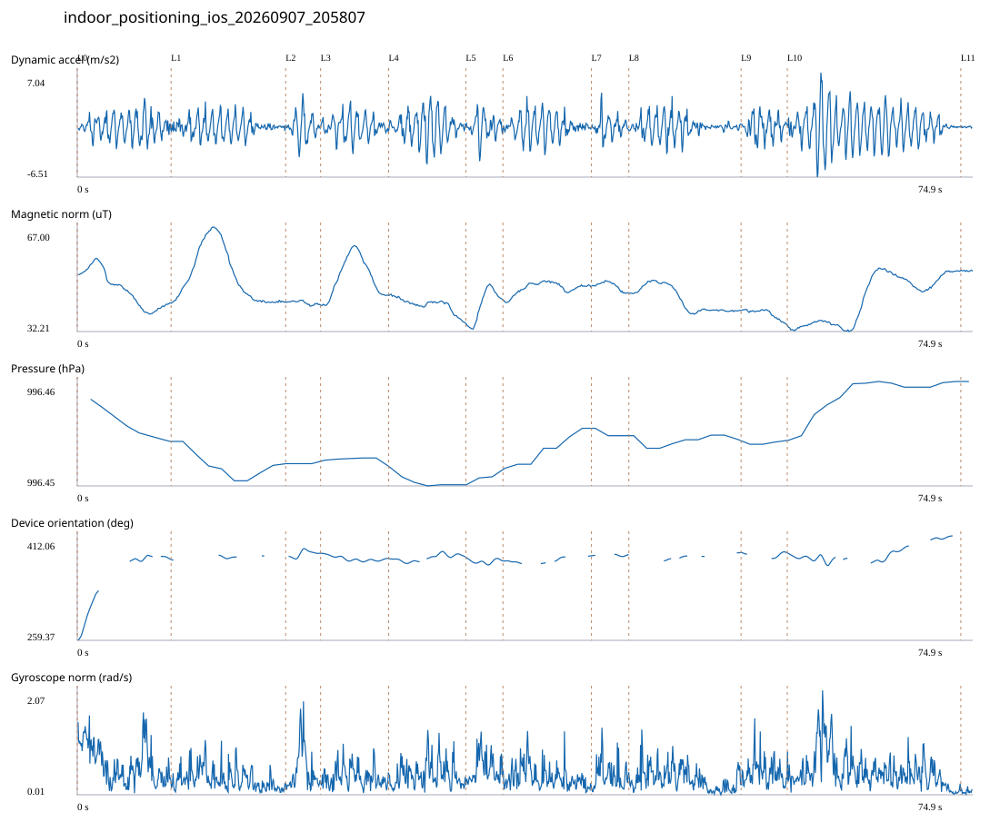

# 4F_CORE_TO_RIGHT_STAIRS / indoor_positioning_ios_20260907_205807.jsonl

원본: `C:\Users\20222967\Documents\카카오톡 받은 파일\indoor_positioning_ios_20260907_205807.jsonl`

SHA-256: `5386a04d7e7cb5f3aab99f7828a4e78fc03ca8a2c78d471c66a64583d1001cce`

기존 분석: none found / 기존 상태: unregistered_diagnostic

시간 74.949초 · 카운터 64.000 · 가속도 피크 후보(.7/1/1.3): {'0.7': 93, '1.0': 85, '1.3': 78}

방향 출처: `absolute_heading_degrees`. 휴대폰 회전 후보를 보행 회전으로 확정하지 않는다.

L0,L1…은 원본 라벨 시점이다. 표시 위치 정답이나 지도 경로가 아니다.

## 품질·한계

- Zero counter increments coexist with acceleration peaks; counter-only segment distance is unreliable.
- External/unregistered source; analyzed as diagnostic, not automatically accepted for training.

## 센서 기록

|센서|샘플|동일 wall time|중앙 간격 ms|최대 공백 s|
|---|---:|---:|---:|---:|
|accelerometer_mps2|1505|0|50.000|0.091|
|device_motion_rotation_rads|1505|0|50.000|0.084|
|gyroscope_rads|1505|0|50.000|0.091|
|heading_degrees|699|171|60.000|3.043|
|magnetic_field_ut|753|0|100.000|0.128|
|pressure_hpa|69|0|1076.500|1.533|
|step_counter|29|0|2547.500|5.107|

## 랩 구간 분석

|구간|초|카운터|피크 후보|동적 RMS|B 평균±SD µT|기압차 hPa|기기방향 변화°|
|---|---:|---:|---:|---:|---|---:|---:|
|코어복도 출구 중앙점 → 4213 앞|7.847|4.000|11|1.329|46.311 ± 5.921|-0.006|118.344|
|4213 앞 → 4212 앞|9.591|8.000|10|1.081|50.441 ± 8.858|-0.003|5.490|
|4212 앞 → 4211 앞|2.922|8.000|3|1.504|41.803 ± 0.589|0.000|4.268|
|4211 앞 → 4210 앞|5.696|8.000|7|1.250|50.432 ± 6.441|0.000|-7.613|
|4210 앞 → 4209 앞|6.455|1.000|8|1.720|41.115 ± 2.329|-0.002|2.197|
|4209 앞 → 4208 앞|3.106|7.000|3|1.357|41.101 ± 5.304|0.001|-4.984|
|4208 앞 → 4207 앞|7.404|3.000|8|1.327|46.664 ± 1.942|0.005|7.441|
|4207 앞 → 4206 앞|3.133|6.000|3|1.150|47.398 ± 1.348|-0.001|1.779|
|4206 앞 → 4205 앞|9.388|0.000|7|1.092|42.905 ± 4.112|-0.000|12.312|
|4205 앞 → 4204 앞|3.868|0.000|4|1.269|38.037 ± 1.619|0.000|-0.266|
|4204 앞 → 오른쪽 계단 입구|14.519|19.000|21|2.091|43.130 ± 7.890|0.007|25.140|
|오른쪽 계단 입구 → session_end (not position truth)|1.020|0.000|0|0.066|52.443 ± 0.159|0.000|—|

## 2초 창의 휴대폰 방향 변화 후보

|시점 s|방향 변화°|자이로 RMS|동시 피크 후보|
|---:|---:|---:|---:|

각도 변화30°/2초는 진단용 기준이다. 자세 변화·자기장 교란·축 정의 영향을 포함한다. 가속도 피크도 실제 걸음 정답이 아니다. 샘플 수는 물리 센서의 독립 관측 수와 같지 않다.
