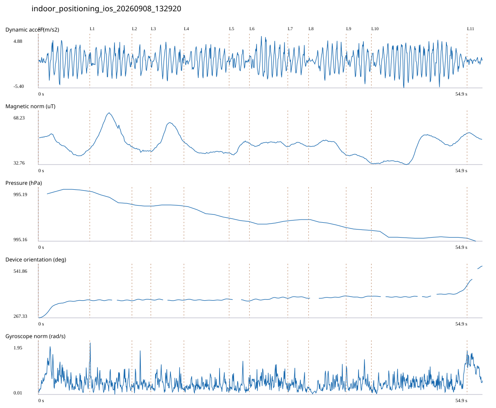

# 4F_CORE_TO_RIGHT_STAIRS / indoor_positioning_ios_20260908_132920.jsonl

원본: `C:\Users\20222967\Documents\ChatGPT\자율설계 2\indoor\data\raw\ios\2026-09-08\indoor_positioning_ios_20260908_132920.jsonl`

SHA-256: `5b0e6c73cb004b1c2db0b4cb7e4d0a506e1b084452251aa4778c6c8a12d658f5`

기존 분석: none found / 기존 상태: unregistered_diagnostic

시간 54.905초 · 카운터 81.000 · 가속도 피크 후보(.7/1/1.3): {'0.7': 85, '1.0': 82, '1.3': 80}

방향 출처: `absolute_heading_degrees`. 휴대폰 회전 후보를 보행 회전으로 확정하지 않는다.

L0,L1…은 원본 라벨 시점이다. 표시 위치 정답이나 지도 경로가 아니다.

## 품질·한계

- External/unregistered source; analyzed as diagnostic, not automatically accepted for training.

## 센서 기록

|센서|샘플|동일 wall time|중앙 간격 ms|최대 공백 s|
|---|---:|---:|---:|---:|
|accelerometer_mps2|1103|0|50.000|0.094|
|device_motion_rotation_rads|1102|0|50.000|0.086|
|gyroscope_rads|1103|0|50.000|0.086|
|heading_degrees|573|29|60.000|0.993|
|magnetic_field_ut|551|0|100.000|0.128|
|pressure_hpa|50|0|1075.000|1.522|
|step_counter|21|0|2547.500|2.563|

## 랩 구간 분석

|구간|초|카운터|피크 후보|동적 RMS|B 평균±SD µT|기압차 hPa|기기방향 변화°|
|---|---:|---:|---:|---:|---|---:|---:|
|코어복도 출구 중앙점 → 4213 앞|6.352|6.000|9|1.968|45.715 ± 5.164|0.002|94.850|
|4213 앞 → 4212 앞|5.215|8.000|9|1.725|55.236 ± 7.809|-0.007|-3.798|
|4212 앞 → 4211 앞|2.335|4.000|3|1.352|42.739 ± 0.958|-0.001|6.101|
|4211 앞 → 4210 앞|4.086|7.000|7|1.727|52.475 ± 6.474|0.000|-2.849|
|4210 앞 → 4209 앞|5.585|8.000|8|1.639|42.110 ± 2.098|-0.006|5.199|
|4209 앞 → 4208 앞|2.512|4.000|3|1.011|44.165 ± 3.530|-0.002|-9.353|
|4208 앞 → 4207 앞|4.733|8.000|8|2.125|47.057 ± 1.100|0.002|14.069|
|4207 앞 → 4206 앞|2.571|4.000|4|1.437|46.528 ± 0.937|0.000|0.037|
|4206 앞 → 4205 앞|4.646|5.000|6|1.676|46.155 ± 2.831|-0.005|11.867|
|4205 앞 → 4204 앞|3.108|5.000|5|1.849|37.911 ± 1.799|-0.001|-1.238|
|4204 앞 → 오른쪽 계단 입구|11.828|17.000|20|2.140|42.771 ± 7.869|-0.002|57.261|
|오른쪽 계단 입구 → session_end (not position truth)|1.934|5.000|0|0.328|52.355 ± 1.630|-0.002|99.584|

## 2초 창의 휴대폰 방향 변화 후보

|시점 s|방향 변화°|자이로 RMS|동시 피크 후보|
|---:|---:|---:|---:|
|1.059|68.671|0.885|2|
|51.759|31.260|0.562|3|
|53.759|113.956|1.136|0|

각도 변화30°/2초는 진단용 기준이다. 자세 변화·자기장 교란·축 정의 영향을 포함한다. 가속도 피크도 실제 걸음 정답이 아니다. 샘플 수는 물리 센서의 독립 관측 수와 같지 않다.
