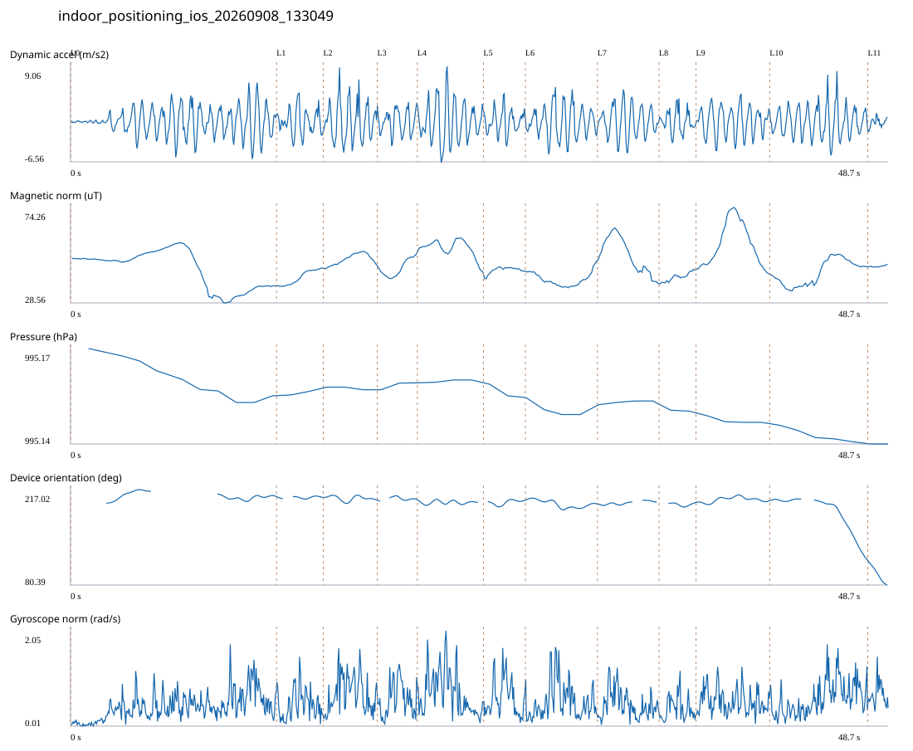

# 4F_CORE_TO_RIGHT_STAIRS_REVERSE / indoor_positioning_ios_20260908_133049.jsonl

원본: `C:\Users\20222967\Documents\ChatGPT\자율설계 2\indoor\data\raw\ios\2026-09-08\indoor_positioning_ios_20260908_133049.jsonl`

SHA-256: `339142dee5907606a51e3139b6e13b79147492e56adacdc684712af0229884bc`

기존 분석: none found / 기존 상태: unregistered_diagnostic

시간 48.670초 · 카운터 73.000 · 가속도 피크 후보(.7/1/1.3): {'0.7': 79, '1.0': 78, '1.3': 78}

방향 출처: `absolute_heading_degrees`. 휴대폰 회전 후보를 보행 회전으로 확정하지 않는다.

L0,L1…은 원본 라벨 시점이다. 표시 위치 정답이나 지도 경로가 아니다.

## 품질·한계

- External/unregistered source; analyzed as diagnostic, not automatically accepted for training.

## 센서 기록

|센서|샘플|동일 wall time|중앙 간격 ms|최대 공백 s|
|---|---:|---:|---:|---:|
|accelerometer_mps2|978|0|50.000|0.086|
|device_motion_rotation_rads|977|0|50.000|0.078|
|gyroscope_rads|978|0|50.000|0.093|
|heading_degrees|539|30|51.500|3.857|
|magnetic_field_ut|489|0|100.000|0.128|
|pressure_hpa|45|0|1075.000|1.520|
|step_counter|15|0|2547.500|5.102|

## 랩 구간 분석

|구간|초|카운터|피크 후보|동적 RMS|B 평균±SD µT|기압차 hPa|기기방향 변화°|
|---|---:|---:|---:|---:|---|---:|---:|
|오른쪽 계단 입구 → 4204 앞|12.260|12.000|17|2.217|44.814 ± 9.053|-0.013|12.915|
|4204 앞 → 4205 앞|2.778|4.000|5|2.082|40.685 ± 3.343|0.001|-0.781|
|4205 앞 → 4206 앞|3.216|5.000|5|3.095|49.446 ± 2.634|-0.001|-3.903|
|4206 앞 → 4207 앞|2.384|4.000|5|1.931|45.090 ± 3.905|0.002|0.798|
|4207 앞 → 4208 앞|3.932|4.000|7|3.286|54.605 ± 4.130|0.001|-3.002|
|4208 앞 → 4209 앞|2.497|4.000|4|1.867|44.271 ± 1.527|-0.003|1.746|
|4209 앞 → 4210 앞|4.289|9.000|7|2.551|39.781 ± 3.222|-0.005|-5.269|
|4210 앞 → 4211 앞|3.665|5.000|6|2.457|51.225 ± 8.466|0.001|2.507|
|4211 앞 → 4212 앞|2.203|4.000|3|1.736|40.926 ± 2.048|-0.000|1.426|
|4212 앞 → 4213 앞|4.383|9.000|8|2.312|56.538 ± 10.330|-0.002|2.216|
|4213 앞 → 코어복도 출구 중앙점|5.840|8.000|10|2.456|43.068 ± 5.888|-0.004|-85.480|
|코어복도 출구 중앙점 → session_end (not position truth)|1.223|5.000|1|0.744|46.126 ± 0.399|0.000|-34.028|

## 2초 창의 휴대폰 방향 변화 후보

|시점 s|방향 변화°|자이로 RMS|동시 피크 후보|
|---:|---:|---:|---:|
|45.233|-36.866|0.887|4|
|47.233|-76.939|0.802|3|

각도 변화30°/2초는 진단용 기준이다. 자세 변화·자기장 교란·축 정의 영향을 포함한다. 가속도 피크도 실제 걸음 정답이 아니다. 샘플 수는 물리 센서의 독립 관측 수와 같지 않다.
