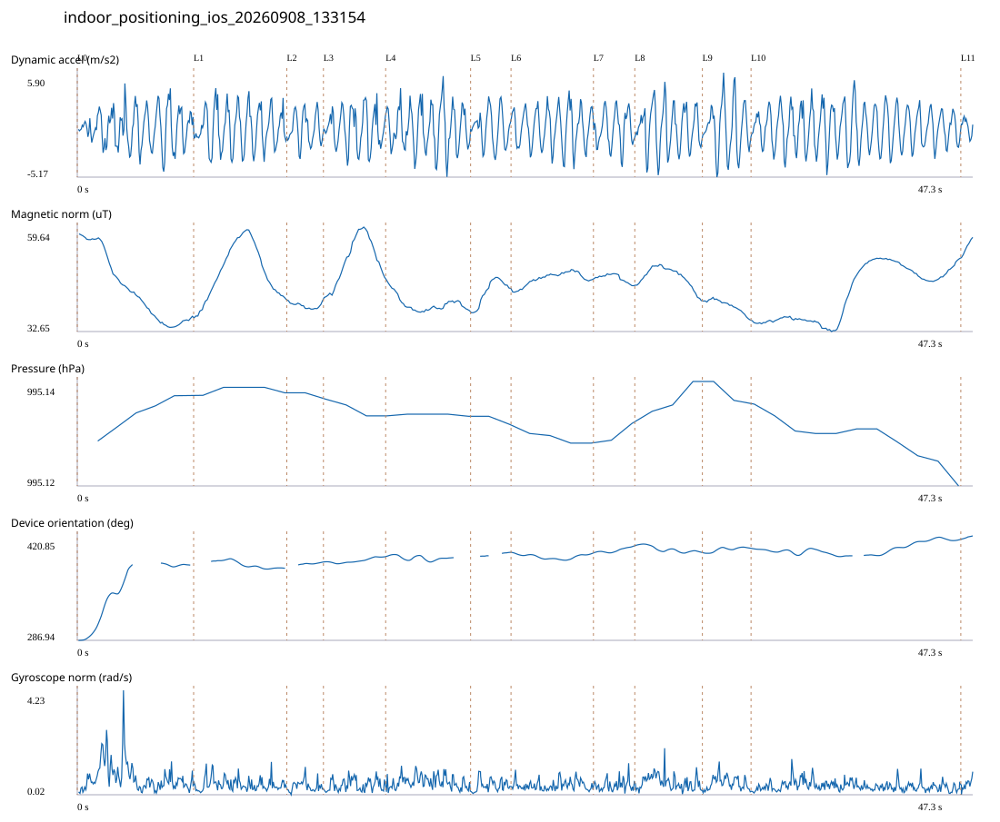

# 4F_CORE_TO_RIGHT_STAIRS / indoor_positioning_ios_20260908_133154.jsonl

원본: `C:\Users\20222967\Documents\ChatGPT\자율설계 2\indoor\data\raw\ios\2026-09-08\indoor_positioning_ios_20260908_133154.jsonl`

SHA-256: `f655d48b3a907deb7778bc1239f3ae37eec43ec2e955ba7c506582363f35591c`

기존 분석: none found / 기존 상태: unregistered_diagnostic

시간 47.302초 · 카운터 70.000 · 가속도 피크 후보(.7/1/1.3): {'0.7': 78, '1.0': 78, '1.3': 76}

방향 출처: `absolute_heading_degrees`. 휴대폰 회전 후보를 보행 회전으로 확정하지 않는다.

L0,L1…은 원본 라벨 시점이다. 표시 위치 정답이나 지도 경로가 아니다.

## 품질·한계

- Zero counter increments coexist with acceleration peaks; counter-only segment distance is unreliable.
- External/unregistered source; analyzed as diagnostic, not automatically accepted for training.

## 센서 기록

|센서|샘플|동일 wall time|중앙 간격 ms|최대 공백 s|
|---|---:|---:|---:|---:|
|accelerometer_mps2|950|0|50.000|0.090|
|device_motion_rotation_rads|949|0|50.000|0.101|
|gyroscope_rads|950|0|50.000|0.093|
|heading_degrees|411|11|60.000|1.413|
|magnetic_field_ut|475|0|100.000|0.151|
|pressure_hpa|43|0|1074.000|1.513|
|step_counter|15|0|2547.500|5.097|

## 랩 구간 분석

|구간|초|카운터|피크 후보|동적 RMS|B 평균±SD µT|기압차 hPa|기기방향 변화°|
|---|---:|---:|---:|---:|---|---:|---:|
|코어복도 출구 중앙점 → 4213 앞|6.142|0.000|10|1.939|43.731 ± 8.525|0.008|96.459|
|4213 앞 → 4212 앞|4.918|10.000|8|2.134|48.031 ± 6.936|0.000|-8.700|
|4212 앞 → 4211 앞|1.933|5.000|3|1.606|39.327 ± 0.685|0.000|3.653|
|4211 앞 → 4210 앞|3.284|4.000|5|1.963|51.030 ± 5.974|-0.003|6.719|
|4210 앞 → 4209 앞|4.483|4.000|8|2.311|39.825 ± 2.063|-0.000|-1.534|
|4209 앞 → 4208 앞|2.133|4.000|3|1.808|43.029 ± 3.169|-0.001|5.007|
|4208 앞 → 4207 앞|4.351|9.000|8|2.046|46.325 ± 1.637|-0.002|-1.080|
|4207 앞 → 4206 앞|2.183|4.000|3|1.833|46.460 ± 0.996|0.003|8.967|
|4206 앞 → 4205 앞|3.567|4.000|6|2.307|46.741 ± 2.574|0.005|-8.847|
|4205 앞 → 4204 앞|2.568|4.000|4|2.674|39.328 ± 1.640|-0.003|5.747|
|4204 앞 → 오른쪽 계단 입구|11.072|17.000|19|2.114|42.507 ± 6.945|-0.012|11.361|
|오른쪽 계단 입구 → session_end (not position truth)|0.668|5.000|1|0.851|54.506 ± 1.809|—|4.235|

## 2초 창의 휴대폰 방향 변화 후보

|시점 s|방향 변화°|자이로 RMS|동시 피크 후보|
|---:|---:|---:|---:|
|1.063|59.608|1.060|3|

각도 변화30°/2초는 진단용 기준이다. 자세 변화·자기장 교란·축 정의 영향을 포함한다. 가속도 피크도 실제 걸음 정답이 아니다. 샘플 수는 물리 센서의 독립 관측 수와 같지 않다.
