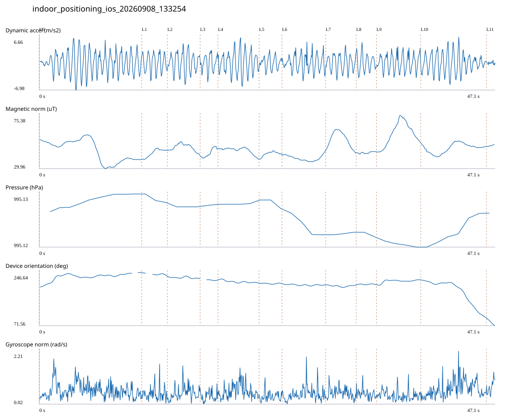

# 4F_CORE_TO_RIGHT_STAIRS_REVERSE / indoor_positioning_ios_20260908_133254.jsonl

원본: `C:\Users\20222967\Documents\ChatGPT\자율설계 2\indoor\data\raw\ios\2026-09-08\indoor_positioning_ios_20260908_133254.jsonl`

SHA-256: `ea005fd1e98b5f0250931a1a84cd11ee3d8a1ced8d26824ba08566c968d40816`

기존 분석: none found / 기존 상태: unregistered_diagnostic

시간 47.134초 · 카운터 70.000 · 가속도 피크 후보(.7/1/1.3): {'0.7': 77, '1.0': 77, '1.3': 76}

방향 출처: `absolute_heading_degrees`. 휴대폰 회전 후보를 보행 회전으로 확정하지 않는다.

L0,L1…은 원본 라벨 시점이다. 표시 위치 정답이나 지도 경로가 아니다.

## 품질·한계

- Zero counter increments coexist with acceleration peaks; counter-only segment distance is unreliable.
- External/unregistered source; analyzed as diagnostic, not automatically accepted for training.

## 센서 기록

|센서|샘플|동일 wall time|중앙 간격 ms|최대 공백 s|
|---|---:|---:|---:|---:|
|accelerometer_mps2|947|0|50.000|0.080|
|device_motion_rotation_rads|946|0|50.000|0.088|
|gyroscope_rads|947|0|50.000|0.080|
|heading_degrees|517|0|59.000|0.637|
|magnetic_field_ut|473|0|99.000|0.127|
|pressure_hpa|43|0|1075.500|1.513|
|step_counter|15|0|2547.500|5.099|

## 랩 구간 분석

|구간|초|카운터|피크 후보|동적 RMS|B 평균±SD µT|기압차 hPa|기기방향 변화°|
|---|---:|---:|---:|---:|---|---:|---:|
|오른쪽 계단 입구 → 4204 앞|10.587|14.000|17|2.827|45.399 ± 9.287|0.005|47.828|
|4204 앞 → 4205 앞|2.650|0.000|5|2.301|43.327 ± 3.349|-0.002|-11.990|
|4205 앞 → 4206 앞|3.384|4.000|6|2.601|48.022 ± 3.059|0.000|-6.372|
|4206 앞 → 4207 앞|1.850|4.000|3|2.069|43.469 ± 3.710|0.000|-4.688|
|4207 앞 → 4208 앞|4.251|9.000|7|2.891|45.548 ± 2.715|0.000|-10.655|
|4208 앞 → 4209 앞|2.366|5.000|3|1.538|42.571 ± 1.967|-0.002|-1.477|
|4209 앞 → 4210 앞|4.517|5.000|8|2.146|38.818 ± 2.276|-0.006|-3.841|
|4210 앞 → 4211 앞|3.150|8.000|5|2.089|54.950 ± 6.646|0.001|-0.685|
|4211 앞 → 4212 앞|2.098|4.000|4|2.192|43.563 ± 0.717|-0.001|0.919|
|4212 앞 → 4213 앞|4.573|5.000|8|2.130|59.358 ± 9.845|-0.002|16.386|
|4213 앞 → 코어복도 출구 중앙점|6.792|12.000|11|2.520|47.484 ± 4.024|0.009|-124.930|
|코어복도 출구 중앙점 → session_end (not position truth)|0.916|0.000|0|0.304|49.593 ± 0.603|0.000|-24.609|

## 2초 창의 휴대폰 방향 변화 후보

|시점 s|방향 변화°|자이로 RMS|동시 피크 후보|
|---:|---:|---:|---:|
|1.085|37.024|0.764|2|
|42.885|-31.464|0.919|4|
|44.885|-76.437|0.798|3|

각도 변화30°/2초는 진단용 기준이다. 자세 변화·자기장 교란·축 정의 영향을 포함한다. 가속도 피크도 실제 걸음 정답이 아니다. 샘플 수는 물리 센서의 독립 관측 수와 같지 않다.
