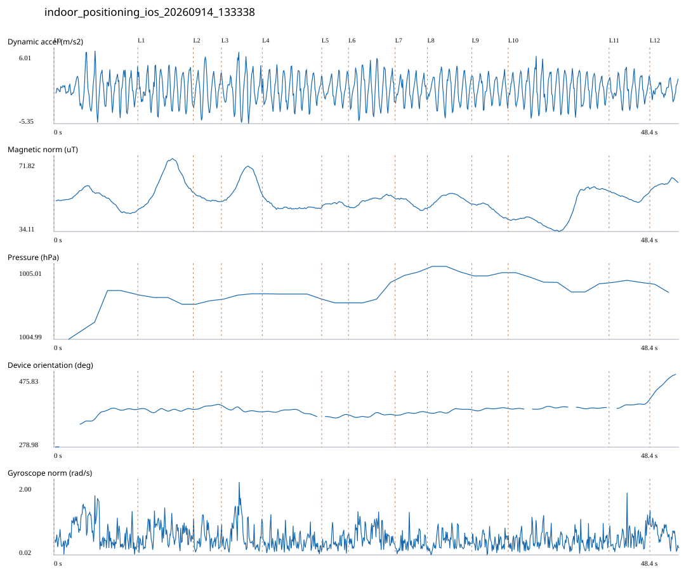

# 4F_CORE_TO_RIGHT_STAIRS / indoor_positioning_ios_20260914_133338.jsonl

원본: `C:\Users\20222967\Documents\카카오톡 받은 파일\indoor_positioning_ios_20260914_133338.jsonl`

SHA-256: `f737f5571d02e838c48eaf41c41c2a4803781d4b4d90ac10f23fc225ba4adb59`

기존 분석: none found / 기존 상태: unregistered_diagnostic

시간 48.450초 · 카운터 71.000 · 가속도 피크 후보(.7/1/1.3): {'0.7': 78, '1.0': 77, '1.3': 76}

방향 출처: `absolute_heading_degrees`. 휴대폰 회전 후보를 보행 회전으로 확정하지 않는다.

L0,L1…은 원본 라벨 시점이다. 표시 위치 정답이나 지도 경로가 아니다.

## 품질·한계

- Zero counter increments coexist with acceleration peaks; counter-only segment distance is unreliable.
- External/unregistered source; analyzed as diagnostic, not automatically accepted for training.

## 센서 기록

|센서|샘플|동일 wall time|중앙 간격 ms|최대 공백 s|
|---|---:|---:|---:|---:|
|accelerometer_mps2|972|0|50.000|0.081|
|device_motion_rotation_rads|972|0|50.000|0.092|
|gyroscope_rads|973|0|50.000|0.108|
|heading_degrees|540|37|56.500|1.526|
|magnetic_field_ut|486|0|100.000|0.142|
|pressure_hpa|44|0|1075.000|1.513|
|step_counter|18|0|2547.000|5.106|

## 랩 구간 분석

|구간|초|카운터|피크 후보|동적 RMS|B 평균±SD µT|기압차 hPa|기기방향 변화°|
|---|---:|---:|---:|---:|---|---:|---:|
|코어복도 출구 중앙점 → 4213 앞|6.499|3.000|9|2.088|50.447 ± 4.325|0.016|101.965|
|4213 앞 → 4212 앞|4.298|8.000|7|2.256|59.338 ± 8.358|-0.003|0.002|
|4212 앞 → 4211 앞|2.182|5.000|3|2.473|50.967 ± 1.322|0.001|11.253|
|4211 앞 → 4210 앞|3.168|4.000|6|2.606|59.068 ± 6.203|0.002|-17.189|
|4210 앞 → 4209 앞|4.606|8.000|8|2.080|46.837 ± 1.466|-0.002|-12.899|
|4209 앞 → 4208 앞|2.077|0.000|3|1.583|48.405 ± 0.673|0.000|4.453|
|4208 앞 → 4207 앞|3.617|9.000|6|2.532|50.189 ± 2.151|0.007|-0.003|
|4207 앞 → 4206 앞|2.500|4.000|4|1.701|48.407 ± 2.360|0.001|7.381|
|4206 앞 → 4205 앞|3.446|4.000|6|2.121|51.004 ± 2.261|-0.002|7.863|
|4205 앞 → 4204 앞|2.812|4.000|4|1.717|45.629 ± 2.868|0.001|3.839|
|4204 앞 → 오른쪽 끝 화장실 통로 앞|7.825|13.000|13|2.180|44.552 ± 8.345|-0.004|2.665|
|오른쪽 끝 화장실 통로 앞 → 오른쪽 계단 입구|3.155|9.000|6|1.749|51.874 ± 1.668|0.000|23.560|
|오른쪽 계단 입구 → session_end (not position truth)|2.265|0.000|2|0.936|58.803 ± 1.730|-0.003|66.397|

## 2초 창의 휴대폰 방향 변화 후보

|시점 s|방향 변화°|자이로 RMS|동시 피크 후보|
|---:|---:|---:|---:|
|1.109|63.407|0.646|1|
|3.109|35.858|0.988|3|
|45.509|30.982|0.667|3|

각도 변화30°/2초는 진단용 기준이다. 자세 변화·자기장 교란·축 정의 영향을 포함한다. 가속도 피크도 실제 걸음 정답이 아니다. 샘플 수는 물리 센서의 독립 관측 수와 같지 않다.
