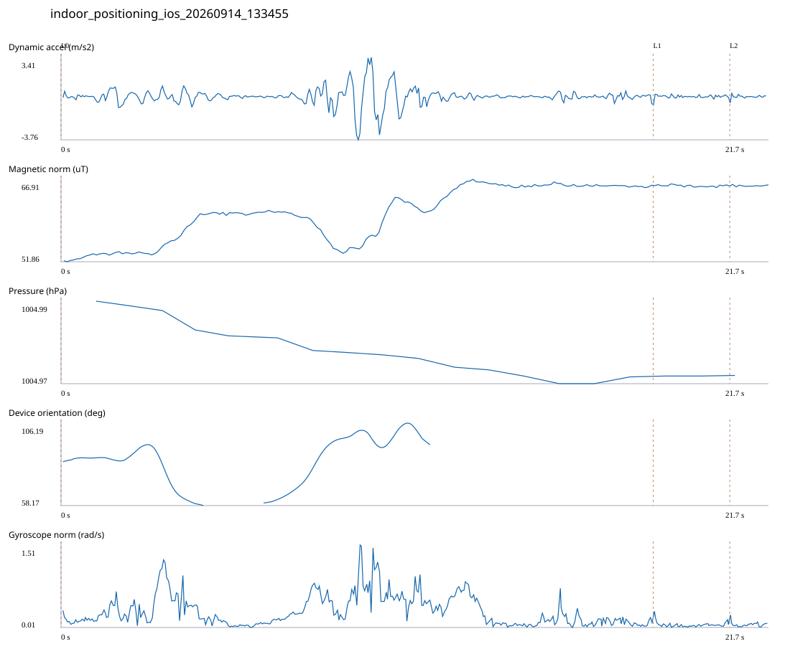

# 4F_RIGHT_STAIR_INTERIOR / indoor_positioning_ios_20260914_133455.jsonl

원본: `C:\Users\20222967\Documents\카카오톡 받은 파일\indoor_positioning_ios_20260914_133455.jsonl`

SHA-256: `b9cec4c9a3b254314479b94161629aeac34e30fbc97bfd91a79bcfe997a002b9`

기존 분석: none found / 기존 상태: unregistered_diagnostic

시간 21.709초 · 카운터 0.000 · 가속도 피크 후보(.7/1/1.3): {'0.7': 8, '1.0': 4, '1.3': 4}

방향 출처: `absolute_heading_degrees`. 휴대폰 회전 후보를 보행 회전으로 확정하지 않는다.

L0,L1…은 원본 라벨 시점이다. 표시 위치 정답이나 지도 경로가 아니다.

## 품질·한계

- Zero counter increments coexist with acceleration peaks; counter-only segment distance is unreliable.
- External/unregistered source; analyzed as diagnostic, not automatically accepted for training.

## 센서 기록

|센서|샘플|동일 wall time|중앙 간격 ms|최대 공백 s|
|---|---:|---:|---:|---:|
|accelerometer_mps2|435|0|50.000|0.086|
|device_motion_rotation_rads|435|0|50.000|0.088|
|gyroscope_rads|435|0|50.000|0.081|
|heading_degrees|170|35|52.000|5.896|
|magnetic_field_ut|218|0|100.000|0.138|
|pressure_hpa|19|0|1075.000|1.512|

## 랩 구간 분석

|구간|초|카운터|피크 후보|동적 RMS|B 평균±SD µT|기압차 hPa|기기방향 변화°|
|---|---:|---:|---:|---:|---|---:|---:|
|오른쪽 계단 입구 → 오른쪽 계단 내부 · 같은 층 평탄부 10초 정지 완료|18.151|0.000|4|0.726|60.520 ± 4.851|-0.020|9.881|
|오른쪽 계단 내부 · 같은 층 평탄부 10초 정지 완료 → 오른쪽 계단 입구|2.347|0.000|0|0.140|65.718 ± 0.163|0.000|—|
|오른쪽 계단 입구 → session_end (not position truth)|1.211|0.000|0|0.145|65.732 ± 0.119|0.000|—|

## 2초 창의 휴대폰 방향 변화 후보

|시점 s|방향 변화°|자이로 RMS|동시 피크 후보|
|---:|---:|---:|---:|
|3.260|-30.490|0.589|0|
|7.210|33.919|0.414|1|

각도 변화30°/2초는 진단용 기준이다. 자세 변화·자기장 교란·축 정의 영향을 포함한다. 가속도 피크도 실제 걸음 정답이 아니다. 샘플 수는 물리 센서의 독립 관측 수와 같지 않다.
