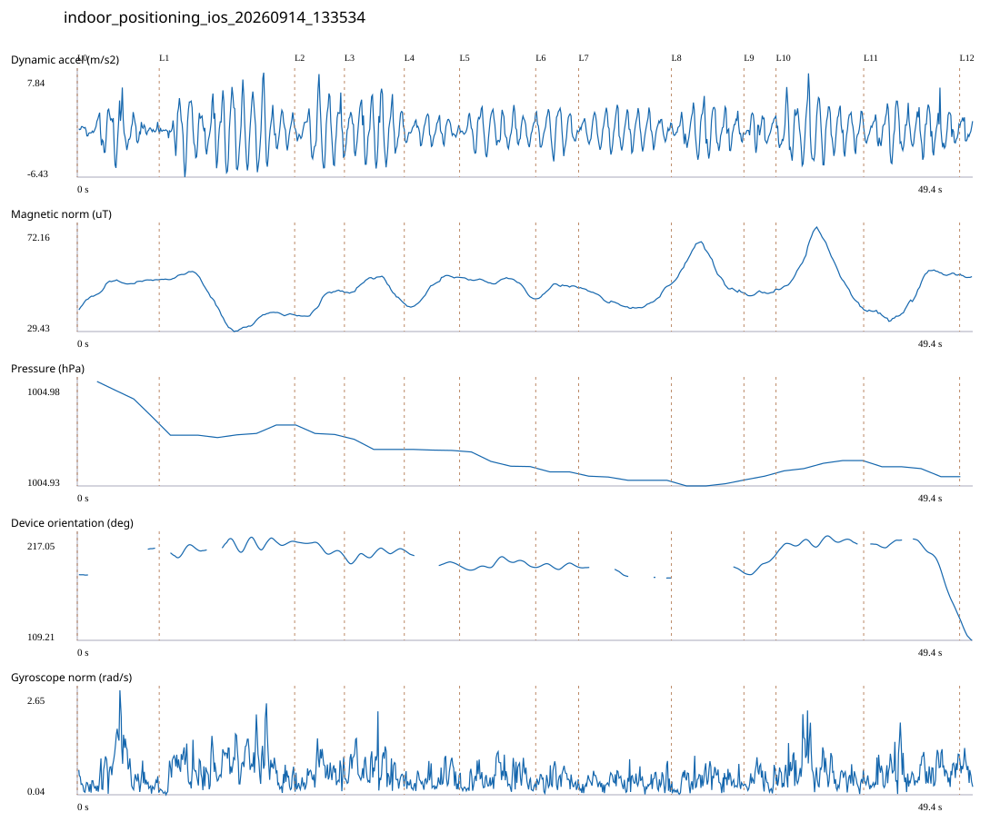

# 4F_CORE_TO_RIGHT_STAIRS_REVERSE / indoor_positioning_ios_20260914_133534.jsonl

원본: `C:\Users\20222967\Documents\카카오톡 받은 파일\indoor_positioning_ios_20260914_133534.jsonl`

SHA-256: `5e393b65e7fbdefcde8006a535d63748d77cf32d23d2441659c2da668c356e29`

기존 분석: none found / 기존 상태: unregistered_diagnostic

시간 49.421초 · 카운터 66.000 · 가속도 피크 후보(.7/1/1.3): {'0.7': 78, '1.0': 77, '1.3': 75}

방향 출처: `absolute_heading_degrees`. 휴대폰 회전 후보를 보행 회전으로 확정하지 않는다.

L0,L1…은 원본 라벨 시점이다. 표시 위치 정답이나 지도 경로가 아니다.

## 품질·한계

- Zero counter increments coexist with acceleration peaks; counter-only segment distance is unreliable.
- External/unregistered source; analyzed as diagnostic, not automatically accepted for training.

## 센서 기록

|센서|샘플|동일 wall time|중앙 간격 ms|최대 공백 s|
|---|---:|---:|---:|---:|
|accelerometer_mps2|992|0|50.000|0.092|
|device_motion_rotation_rads|992|0|50.000|0.091|
|gyroscope_rads|992|0|50.000|0.093|
|heading_degrees|628|100|40.000|3.371|
|magnetic_field_ut|496|0|100.000|0.147|
|pressure_hpa|45|0|1075.500|1.515|
|step_counter|14|0|2548.000|5.069|

## 랩 구간 분석

|구간|초|카운터|피크 후보|동적 RMS|B 평균±SD µT|기압차 hPa|기기방향 변화°|
|---|---:|---:|---:|---:|---|---:|---:|
|오른쪽 계단 입구 → 오른쪽 끝 화장실 통로 앞|4.521|0.000|6|1.659|47.633 ± 3.469|-0.016|27.355|
|오른쪽 끝 화장실 통로 앞 → 4204 앞|7.470|0.000|13|2.991|41.085 ± 8.460|0.005|11.817|
|4204 앞 → 4205 앞|2.745|12.000|4|2.921|40.778 ± 4.369|-0.004|-14.487|
|4205 앞 → 4206 앞|3.302|5.000|6|2.802|47.703 ± 3.221|-0.005|7.203|
|4206 앞 → 4207 앞|3.050|4.000|4|1.152|46.756 ± 4.895|-0.000|-15.430|
|4207 앞 → 4208 앞|4.200|8.000|6|1.715|49.265 ± 2.454|-0.006|-1.770|
|4208 앞 → 4209 앞|2.367|6.000|4|1.921|46.997 ± 1.835|0.000|0.393|
|4209 앞 → 4210 앞|5.117|7.000|8|1.665|42.671 ± 2.981|-0.002|-10.947|
|4210 앞 → 4211 앞|4.000|4.000|6|1.941|54.805 ± 6.873|0.001|5.442|
|4211 앞 → 4212 앞|1.769|4.000|3|1.361|45.109 ± 0.677|0.002|18.065|
|4212 앞 → 4213 앞|4.836|8.000|8|2.682|54.835 ± 9.426|0.005|10.583|
|4213 앞 → 코어복도 출구 중앙점|5.292|8.000|8|2.040|44.107 ± 7.794|-0.004|-75.441|
|코어복도 출구 중앙점 → session_end (not position truth)|0.752|0.000|1|1.137|51.993 ± 0.478|0.000|-21.913|

## 2초 창의 휴대폰 방향 변화 후보

|시점 s|방향 변화°|자이로 RMS|동시 피크 후보|
|---:|---:|---:|---:|
|37.991|30.883|0.496|3|
|47.091|-57.697|0.685|4|

각도 변화30°/2초는 진단용 기준이다. 자세 변화·자기장 교란·축 정의 영향을 포함한다. 가속도 피크도 실제 걸음 정답이 아니다. 샘플 수는 물리 센서의 독립 관측 수와 같지 않다.
