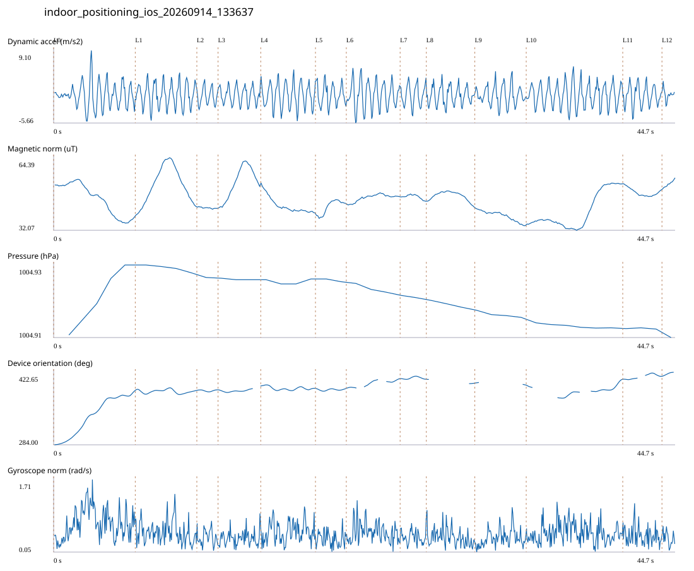

# 4F_CORE_TO_RIGHT_STAIRS / indoor_positioning_ios_20260914_133637.jsonl

원본: `C:\Users\20222967\Documents\카카오톡 받은 파일\indoor_positioning_ios_20260914_133637.jsonl`

SHA-256: `eb795df0a0f6569dec1facb57d56331bb2b23ed51a0b2241228c8abaaaef7755`

기존 분석: none found / 기존 상태: unregistered_diagnostic

시간 44.668초 · 카운터 63.000 · 가속도 피크 후보(.7/1/1.3): {'0.7': 72, '1.0': 72, '1.3': 72}

방향 출처: `absolute_heading_degrees`. 휴대폰 회전 후보를 보행 회전으로 확정하지 않는다.

L0,L1…은 원본 라벨 시점이다. 표시 위치 정답이나 지도 경로가 아니다.

## 품질·한계

- Zero counter increments coexist with acceleration peaks; counter-only segment distance is unreliable.
- External/unregistered source; analyzed as diagnostic, not automatically accepted for training.

## 센서 기록

|센서|샘플|동일 wall time|중앙 간격 ms|최대 공백 s|
|---|---:|---:|---:|---:|
|accelerometer_mps2|897|0|50.000|0.096|
|device_motion_rotation_rads|897|0|50.000|0.079|
|gyroscope_rads|897|0|50.000|0.104|
|heading_degrees|476|59|59.000|3.114|
|magnetic_field_ut|449|0|100.000|0.124|
|pressure_hpa|41|0|1075.000|1.512|
|step_counter|13|0|2547.000|5.095|

## 랩 구간 분석

|구간|초|카운터|피크 후보|동적 RMS|B 평균±SD µT|기압차 hPa|기기방향 변화°|
|---|---:|---:|---:|---:|---|---:|---:|
|코어복도 출구 중앙점 → 4213 앞|5.867|0.000|8|2.512|46.011 ± 6.892|0.021|103.883|
|4213 앞 → 4212 앞|4.425|10.000|8|2.409|52.265 ± 7.883|-0.002|-1.059|
|4212 앞 → 4211 앞|1.525|0.000|2|1.691|42.065 ± 0.305|0.000|0.861|
|4211 앞 → 4210 앞|3.068|4.000|5|1.690|53.267 ± 7.062|-0.000|7.195|
|4210 앞 → 4209 앞|3.933|4.000|7|2.504|43.140 ± 3.572|0.000|-4.643|
|4209 앞 → 4208 앞|2.216|5.000|4|2.153|42.539 ± 3.013|-0.001|0.025|
|4208 앞 → 4207 앞|3.868|8.000|7|2.718|46.580 ± 1.541|-0.003|18.189|
|4207 앞 → 4206 앞|1.883|0.000|3|2.144|46.978 ± 0.964|-0.001|-1.238|
|4206 앞 → 4205 앞|3.485|11.000|5|1.817|47.331 ± 2.024|-0.002|-7.220|
|4205 앞 → 4204 앞|3.694|4.000|6|1.984|38.513 ± 2.289|-0.002|-4.130|
|4204 앞 → 오른쪽 끝 화장실 통로 앞|6.937|12.000|12|2.403|40.402 ± 7.763|-0.002|11.469|
|오른쪽 끝 화장실 통로 앞 → 오른쪽 계단 입구|2.819|5.000|4|2.075|48.956 ± 1.697|-0.000|5.737|
|오른쪽 계단 입구 → session_end (not position truth)|0.948|0.000|1|1.119|52.734 ± 1.475|0.000|7.436|

## 2초 창의 휴대폰 방향 변화 후보

|시점 s|방향 변화°|자이로 RMS|동시 피크 후보|
|---:|---:|---:|---:|
|1.060|35.159|0.612|2|
|3.060|54.631|0.994|4|

각도 변화30°/2초는 진단용 기준이다. 자세 변화·자기장 교란·축 정의 영향을 포함한다. 가속도 피크도 실제 걸음 정답이 아니다. 샘플 수는 물리 센서의 독립 관측 수와 같지 않다.
