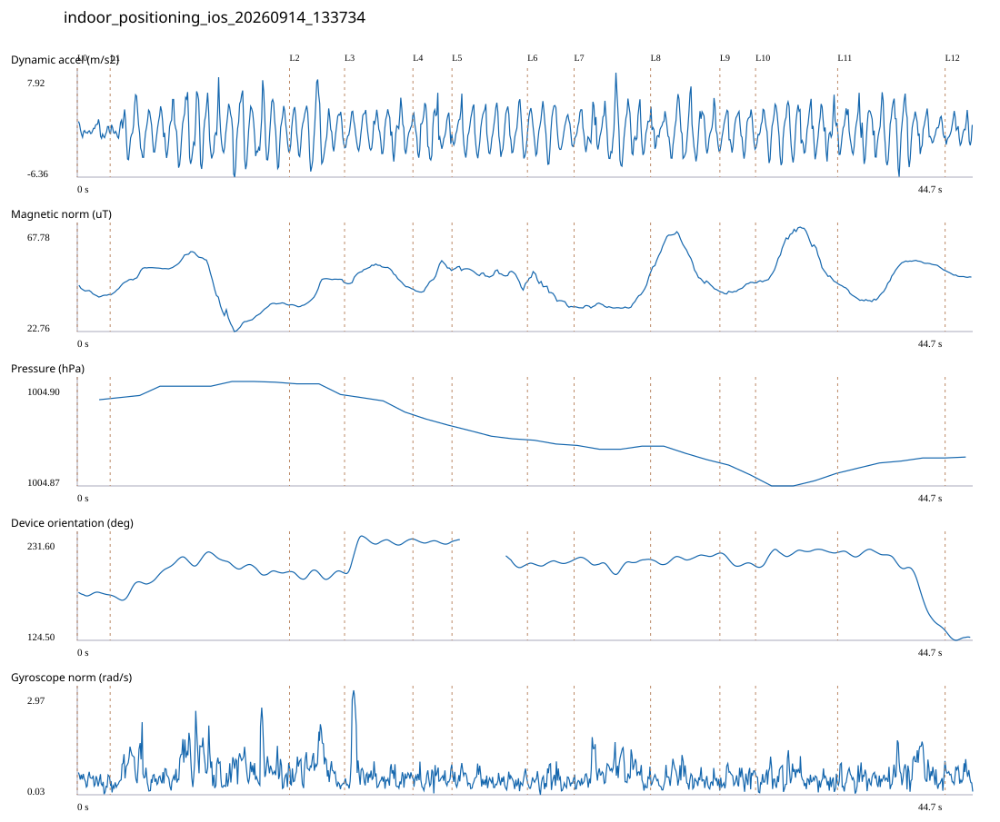

# 4F_CORE_TO_RIGHT_STAIRS_REVERSE / indoor_positioning_ios_20260914_133734.jsonl

원본: `C:\Users\20222967\Documents\카카오톡 받은 파일\indoor_positioning_ios_20260914_133734.jsonl`

SHA-256: `307e61d83f9504a23a46c7349aaf1854638c5b3d650e35533b5e019d631ab0bc`

기존 분석: none found / 기존 상태: unregistered_diagnostic

시간 44.754초 · 카운터 66.000 · 가속도 피크 후보(.7/1/1.3): {'0.7': 74, '1.0': 73, '1.3': 73}

방향 출처: `absolute_heading_degrees`. 휴대폰 회전 후보를 보행 회전으로 확정하지 않는다.

L0,L1…은 원본 라벨 시점이다. 표시 위치 정답이나 지도 경로가 아니다.

## 품질·한계

- Zero counter increments coexist with acceleration peaks; counter-only segment distance is unreliable.
- External/unregistered source; analyzed as diagnostic, not automatically accepted for training.

## 센서 기록

|센서|샘플|동일 wall time|중앙 간격 ms|최대 공백 s|
|---|---:|---:|---:|---:|
|accelerometer_mps2|899|0|50.000|0.083|
|device_motion_rotation_rads|898|0|50.000|0.089|
|gyroscope_rads|899|0|50.000|0.082|
|heading_degrees|580|18|46.000|2.275|
|magnetic_field_ut|449|0|100.000|0.130|
|pressure_hpa|41|0|1075.500|1.516|
|step_counter|14|0|2548.000|5.097|

## 랩 구간 분석

|구간|초|카운터|피크 후보|동적 RMS|B 평균±SD µT|기압차 hPa|기기방향 변화°|
|---|---:|---:|---:|---:|---|---:|---:|
|오른쪽 계단 입구 → 오른쪽 끝 화장실 통로 앞|1.643|0.000|1|0.653|39.417 ± 1.393|0.000|-2.570|
|오른쪽 끝 화장실 통로 앞 → 4204 앞|8.962|11.000|15|2.882|41.649 ± 10.248|0.005|23.991|
|4204 앞 → 4205 앞|2.749|4.000|5|2.860|39.965 ± 5.079|-0.003|-1.264|
|4205 앞 → 4206 앞|3.416|4.000|5|1.944|47.311 ± 3.367|-0.005|35.200|
|4206 앞 → 4207 앞|1.951|5.000|4|2.317|45.696 ± 4.779|-0.002|-2.628|
|4207 앞 → 4208 앞|3.771|5.000|6|2.366|47.593 ± 2.223|-0.003|-23.721|
|4208 앞 → 4209 앞|2.330|4.000|4|2.250|40.063 ± 4.783|-0.001|4.252|
|4209 앞 → 4210 앞|3.821|4.000|6|2.563|34.841 ± 3.084|-0.000|-0.131|
|4210 앞 → 4211 앞|3.462|8.000|6|2.403|53.287 ± 8.360|-0.004|6.559|
|4211 앞 → 4212 앞|1.784|0.000|3|1.973|41.184 ± 1.725|-0.003|-13.214|
|4212 앞 → 4213 앞|4.101|8.000|7|2.431|54.830 ± 8.632|0.004|14.308|
|4213 앞 → 코어복도 출구 중앙점|5.368|8.000|9|2.485|45.304 ± 6.700|0.003|-79.146|
|코어복도 출구 중앙점 → session_end (not position truth)|1.396|5.000|2|1.341|47.018 ± 0.896|0.000|-6.854|

## 2초 창의 휴대폰 방향 변화 후보

|시점 s|방향 변화°|자이로 RMS|동시 피크 후보|
|---:|---:|---:|---:|
|3.313|30.573|0.833|4|
|13.013|30.980|1.246|4|
|41.013|-31.247|0.735|4|
|43.013|-57.516|0.752|3|

각도 변화30°/2초는 진단용 기준이다. 자세 변화·자기장 교란·축 정의 영향을 포함한다. 가속도 피크도 실제 걸음 정답이 아니다. 샘플 수는 물리 센서의 독립 관측 수와 같지 않다.
