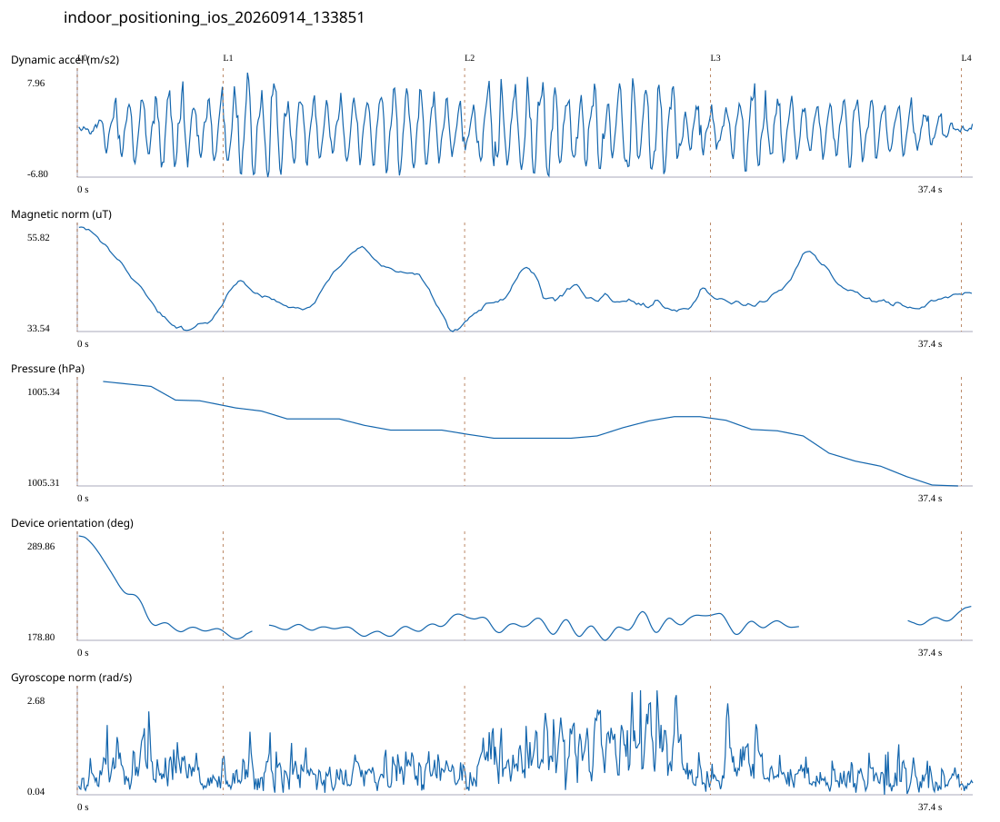

# 3F_CORE_TO_LEFT_STAIRS / indoor_positioning_ios_20260914_133851.jsonl

원본: `C:\Users\20222967\Documents\카카오톡 받은 파일\indoor_positioning_ios_20260914_133851.jsonl`

SHA-256: `694246ea97ca6e4ea6c9b1ee180adb89fb2eaafb9ac6dbc4813b3e9eaf21c6fb`

기존 분석: none found / 기존 상태: unregistered_diagnostic

시간 37.448초 · 카운터 58.000 · 가속도 피크 후보(.7/1/1.3): {'0.7': 65, '1.0': 64, '1.3': 63}

방향 출처: `absolute_heading_degrees`. 휴대폰 회전 후보를 보행 회전으로 확정하지 않는다.

L0,L1…은 원본 라벨 시점이다. 표시 위치 정답이나 지도 경로가 아니다.

## 품질·한계

- Zero counter increments coexist with acceleration peaks; counter-only segment distance is unreliable.
- External/unregistered source; analyzed as diagnostic, not automatically accepted for training.

## 센서 기록

|센서|샘플|동일 wall time|중앙 간격 ms|최대 공백 s|
|---|---:|---:|---:|---:|
|accelerometer_mps2|752|0|50.000|0.077|
|device_motion_rotation_rads|752|0|50.000|0.092|
|gyroscope_rads|752|0|50.000|0.090|
|heading_degrees|624|51|40.000|4.519|
|magnetic_field_ut|376|0|100.000|0.131|
|pressure_hpa|34|0|1077.000|1.510|
|step_counter|11|0|2549.000|5.105|

## 랩 구간 분석

|구간|초|카운터|피크 후보|동적 RMS|B 평균±SD µT|기압차 hPa|기기방향 변화°|
|---|---:|---:|---:|---:|---|---:|---:|
|코어복도 출구 중앙점 → 3120 앞|6.096|0.000|10|2.765|42.629 ± 7.623|-0.007|-100.728|
|3120 앞 → 3128-B 앞|10.095|17.000|18|3.489|43.061 ± 4.604|-0.008|16.630|
|3128-B 앞 → 3128-A 앞|10.276|18.000|18|3.624|40.685 ± 2.393|0.007|1.152|
|3128-A 앞 → 왼쪽 계단 입구|10.487|23.000|18|2.565|41.853 ± 3.256|-0.021|4.345|
|왼쪽 계단 입구 → session_end (not position truth)|0.494|0.000|0|0.290|41.708 ± 0.171|—|4.007|

## 2초 창의 휴대폰 방향 변화 후보

|시점 s|방향 변화°|자이로 RMS|동시 피크 후보|
|---:|---:|---:|---:|
|1.065|-61.498|0.730|2|
|3.065|-37.308|0.903|4|

각도 변화30°/2초는 진단용 기준이다. 자세 변화·자기장 교란·축 정의 영향을 포함한다. 가속도 피크도 실제 걸음 정답이 아니다. 샘플 수는 물리 센서의 독립 관측 수와 같지 않다.
